# 1. Databricks Lakehouse Platform

# Introduction

## What is databricks

Multi-cloud **Lakehouse Platform** based on Apache-Spark

A Lake house is one platform that unify all of your data engineering, analytics, and AI workload.

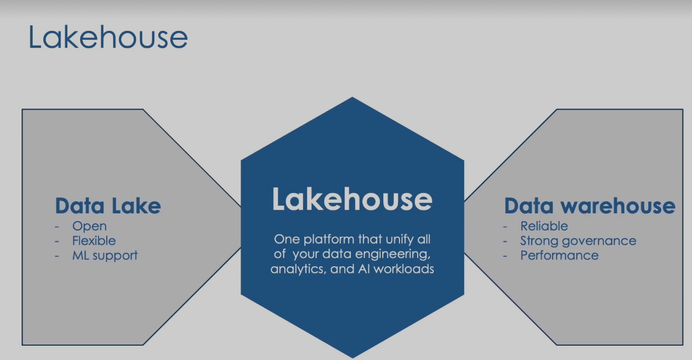

### Architecture

It is divided into three layers:

1. Cloud Service: 
2. RunTime: Core components 
3. WorkSpace

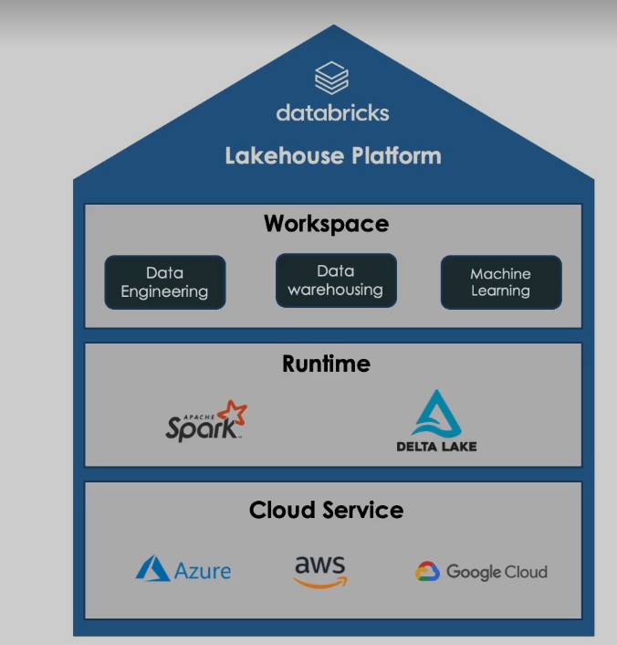

### How databricks resources are deployed in the cloud provider

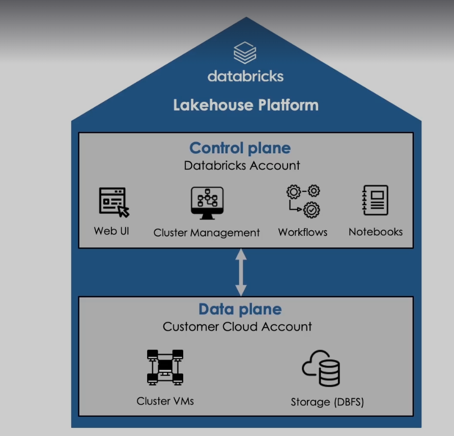

### Spark on databricks

- Databricks was funded by the engineers that built Spark. Because of that the data is distributed and process in memory by multiple nodes in a cluster.
- Allows for Spark Batch processing & stream processing
- It can handle Structured, semi structured, & unstructured data
- Because it handles the data in a distributed manner (because is based on Apache Spark) it offers a distributed file system (DataBricks File System DBFS).
- It comes preinstall in the Databricks cluster.
- DBFS is an abstraction layer where  data persisted to the underlaying cloud storage
    
    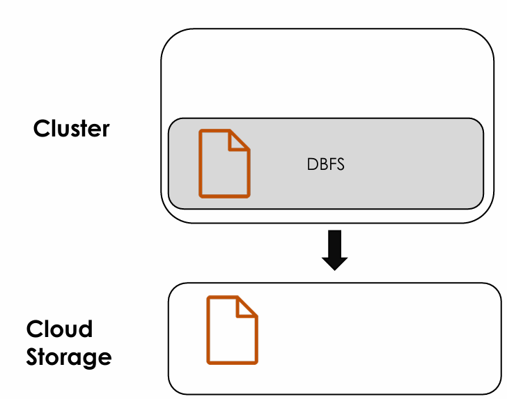
    

### Creating a Cluster

### Notebook Fundamentals

Creating a Cluster. Is done in the interface on

1. Navigate to the **Compute** tab in the left side bar.
2.  Under **All-purpose compute** tab, click **Create compute**. 

```markdown
 Creating a Demo Cluster

 MAGIC Create a cluster with the following configurations:
 
 | Setting | Instructions |
 |--|--|
 |Cluster name|**Demo Cluster**|
 |Cluster mode|**Signle node**|
 |Runtime version|Select the Databricks runtime version 13.3 LTS|
 |Photon Acceleration| Uncheck the option |
 |Node type|4 cores|
 |Auto termination|30 minutes|
```

### Notebook Basics

**Magic command (%)**: Initially the notebook is in python but it can be simply change to any languages using magic command %

```python
%sql
```

**Run other notebook from the current notebook (%run)**

```markdown
%run./path/name_of_notebook_we_want_to_run
```

File System (%fs): Deals with file systems operations like ls. For example:

```python
fs ls '/databricks-datasets'
```

**dbutils**: Another way to deal with file system operations.

To get all commands of dbutils you can use 

```python
dbutils.help()
```

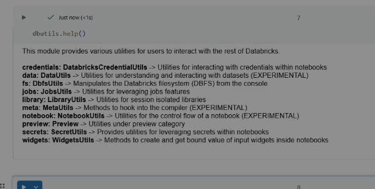

For example the file system management is done using dbutils.fs. To get more info:

```python
dbutils.fs.help()
```

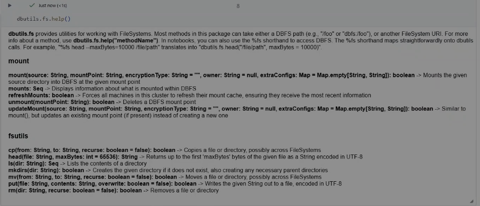

dbutils are more useful than fs command because you can include python logic in the dbutils command.

# Databricks Intelligence Platform

## Data Lake

A **data lake** is a big, cheap storage repository (usually on cloud object storage like S3, ADLS, GCS) where you dump **all kinds of data in raw format**:

- Structured: tables, CSVs
- Semi-structured: JSON, logs
- Unstructured: PDFs, images, audio, etc.

**Key ideas:**

- **Store now, decide later**: you don’t need a strict schema before ingesting.
- Very **scalable and low-cost**.
- Used as the base layer for **analytics, ML, BI, streaming**.

**Why “classic” data lakes are problematic?**

Because they’re just files in object storage + some conventions, you typically get issues like:

1. **No ACID transactions**
    - Multiple jobs writing/reading the same path can corrupt data or see partial writes.
    - No guarantee that a read sees a consistent snapshot.
2. **Limited schema & data quality control**
    - “Schema-on-read” means any file can land there.
    - If producers change a column, type, or add/drop fields, consumers can break.
    - Easy to end with inconsistent formats → **“data swamp”**. [Wikipedia+1](https://en.wikipedia.org/wiki/Data_lake?utm_source=chatgpt.com)
3. **Hard deletes/updates (GDPR, corrections)**
    - Raw files are append-only.
    - Doing `UPDATE` / `DELETE` is painful (rewrite partitions manually, manage versions yourself).
4. **Metadata scalability**
    - To know “what’s in this table”, engines often need to **list millions of files** → slow planning and queries.
5. **Batch vs streaming mismatch**
    - Streaming and batch pipelines often write to different paths/formats and modeling them as “the same table” is messy.
6. **Governance & audit**
    - Hard to know **who changed what and when**, or to time-travel to a previous consistent version.

## Delta Lake

**Delta Lake** is an **open-source storage layer** that sits on top of your data lake (S3, ADLS, GCS, etc.) and turns it into **ACID tables**. 

Core idea:

- Your data is still Parquet files in object storage.
- Delta adds a **transaction log** (`_delta_log`) that tracks every change (adds/removes files, schema updates, etc.).

It provides:

- **ACID transactions** over files.
- **Scalable metadata** (no more scanning millions of files every time).
- **Schema enforcement & evolution**.
- **Upserts / Deletes / Merge** operations.
- **Time travel** (query a table as-of a past version).
- Unified **batch + streaming** on the same table.

### How Delta Lake fixes data lake problems

Let’s map problem → Delta feature:

### (a) Inconsistent, partial writes → **ACID transactions**

- Delta uses a **write-ahead transaction log** and commits changes atomically.
- Readers always see a **consistent snapshot** of the table (a specific log version).

Result:

No more “half a partition updated” or “reader saw partially written files”.

---

### (b) Schema chaos → **Schema enforcement + evolution**

- You can enable **schema enforcement** (reject incompatible writes).
- You can allow **schema evolution** (add new columns safely, with control).

Result:

Higher data quality, fewer silent breaks when upstreams change.

---

### (c) Deletes & updates are hard → **MERGE, DELETE, UPDATE**

Delta adds **database-like DML** on top of your lake:

```sql
DELETE FROM table WHERE customer_id = 123;
UPDATE table SET status = 'inactive' WHERE last_login < '2023-01-01';
MERGE INTO target USING source ON ...
```

Internally it rewrites files and updates the log, but you don’t manage files manually.

Result:

Regulatory deletes (GDPR), corrections, slowly changing dimensions, etc., become feasible.

---

### (d) Slow metadata & planning → **Optimized metadata handling**

- The transaction log keeps a compacted view of **which files belong to the table and where**.
- Engines can read metadata from the log instead of listing the entire storage path. [VLDB](https://www.vldb.org/pvldb/vol13/p3411-armbrust.pdf?utm_source=chatgpt.com)

Result:

Faster planning, especially for **large tables with many partitions/files**.

---

### (e) Batch vs streaming split → **Unified batch + streaming**

- The same **Delta table** can be the target/source for both **streaming** and **batch** workloads.
- Streaming reads just follow the transaction log as new commits arrive.

Result:

Simpler architecture, fewer duplicate paths and formats.

---

### (f) Auditing & “oops I broke it” → **Time travel & history**

- Since every commit is in the log, you can query **by version** or **timestamp**:

```sql
SELECT * FROM table VERSION AS OF 42;
SELECT * FROM table TIMESTAMP AS OF '2025-11-01T10:00:00';
```

Result:

Easy debugging, reproducible experiments, rollback scenarios.

---

### Short summary you can reuse for the exam

- **Data Lake**:
    
    Low-cost, scalable repository (usually object storage) that stores **raw structured, semi-structured, and unstructured data** in native format for analytics and ML. Powerful but prone to **data quality, governance, and consistency problems**.
    
- **Problems of Data Lakes**:
    
    No ACID transactions, weak schema/data quality controls, painful updates/deletes, slow metadata operations, divergence between batch and streaming, and governance/audit gaps → risk of turning into a **“data swamp”**.
    
- **Delta Lake**:
    
    **Open-source storage layer** on top of a data lake that adds **ACID transactions, scalable metadata, schema enforcement/evolution, DML operations, time travel, and unified batch/streaming** by maintaining a transaction log over Parquet files.
    
- **How Delta Lake helps**:
    
    It transforms a “dumb” file-based data lake into a **reliable, query-friendly Lakehouse** layer with strong guarantees, without giving up the flexibility and low cost of object storage.
    

## Delta Log (Delta Lake Log Operation)

For each Delta table (a folder in your data lake), you have a subfolder:

```
/table_path/
  ├── part-0000-....snappy.parquet
  ├── ...
  └── _delta_log/
        ├── 00000000000000000000.json
        ├── 00000000000000000001.json
        ├── ...
        └── 00000000000000000010.checkpoint.parquet

```

- `_delta_log` = **transaction log** of the table.
- Each file (log entry) represents **one committed version** of the table.
- Version numbers start at 0 and increase: `0.json`, `1.json`, `2.json`, …

This log is what gives you **ACID** and **time travel**.

### High-level life cycle of a write (step-by-step)

Let’s suppose you run an operation:

```sql
INSERT INTO sales_delta
SELECT * FROM new_data;
```

Under the hood, Delta Lake roughly does:

1. **Plan the operation**
    - Determine what to read/write, partitioning, etc.
    - Decide which new Parquet files will be created, which old files (if any) will be removed.
2. **Write data files first (but not visible yet)**
    - It writes the new data to **temporary Parquet files** in the table’s storage path (often with temp names).
    - These files exist physically, but **no reader considers them “part of the table” yet**, because the log isn’t updated.
3. **Prepare actions for the log**
    - Delta encodes “actions” describing this commit, for example:
        - `add` file actions → which Parquet files are added.
        - `remove` file actions → which files are removed (for UPDATE/DELETE/MERGE).
        - `metaData` action → table schema/partition columns/etc. (if changed).
        - `protocol` action → min reader/writer versions.
        - `txn` action → transaction identifiers for idempotency (important for streaming).
4. **Acquire a new log version (atomic commit)**
    - Delta tries to write the next log file, e.g. `00000000000000000005.json`.
    - This step is **atomic**: it uses file-system guarantees (like object store atomic PUT) plus a compare-and-swap / optimistic concurrency pattern:
        - If no one wrote version 5 yet → it writes `5.json` and the commit **succeeds**.
        - If someone else already wrote version 5 in the meantime → this commit **fails**, and the writer must re-plan using the new latest version.
    
    This is how Delta guarantees **serializable isolation**: only one writer “wins” per version.
    
5. **Readers see the new snapshot**
    - Once `5.json` exists, any reader asking for the **latest version** will:
        - Read log files up to version 5 (or use a checkpoint + subsequent logs).
        - Build a **snapshot** = set of active files + current metadata.
    - Readers either see version 4 **or** version 5 — but **never** a mix.
    - That’s your **atomicity + consistency + isolation**.
6. **Old snapshots remain queryable (time travel)**
    - Because old log files and Parquet files are not immediately deleted, you can query:
    
    ```sql
    SELECT * FROM sales_delta VERSION AS OF 4;
    ```
    
    - That uses the state of the log **before** commit 5.

### Inside the log files (JSON + checkpoints)

**JSON log files**

Each `N.json` file contains a sequence of **JSON “actions”**, one per line. Conceptually:

```sql
{"add": {...}}        // add this Parquet file to the table
{"remove": {...}}     // remove this Parquet file from the table
{"metaData": {...}}   // table schema, partition info, table properties
{"protocol": {...}}   // min reader/writer versions
{"txn": {...}}        // transaction id for streaming or idempotent writes
```

To reconstruct the table at **version N**:

1. Start from version 0.
2. Apply all actions from `0.json`, `1.json`, …, `N.json` **in order**:
    - Keep track of which files are currently “active” (added but not removed).
    - Track the latest metadata and protocol.
3. The resulting set of active files is the **snapshot** at version N.

### Checkpoints: speeding up metadata

If a table has many versions, reading all JSON from 0 to N is expensive.

So Delta periodically writes **checkpoint files**:

- Example: `00000000000000000100.checkpoint.parquet`
- A checkpoint stores the **full table state** (active files, metadata) at that version in a compact Parquet format.

A reader then does:

1. Find the **latest checkpoint** ≤ desired version.
2. Load the snapshot from the checkpoint.
3. Apply only the **JSON logs** after that checkpoint up to the target version.

This makes metadata operations scale much better for huge tables.

### How this supports ACID guarantees

Let’s tie this back to the ACID properties:

1. **Atomicity**
    - A commit is “visible” only when its corresponding log file (e.g. `5.json`) is successfully written.
    - Either the log file is written completely and readers see the full commit, or they don’t see it at all.
2. **Consistency**
    - Each commit moves the table from one **valid state** to another.
    - Schema enforcement, constraints (e.g., not null), and protocol versions help keep states consistent.
3. **Isolation**
    - Readers always read **one consistent version**.
    - Concurrent writers compete to write the **next version**; conflicts are resolved via optimistic concurrency.
4. **Durability**
    - The log and data files are stored in **durable cloud/object storage**.
    - Once committed, the version is persisted and can be time-traveled later.

### Typical operations and what they do in the log

### `INSERT` (append-only)

- Writes new Parquet files.
- Commit adds `add` actions for the new files.

### `DELETE` / `UPDATE`

- Reads files containing affected rows.
- Writes **new** Parquet files with the modified/filtered rows.
- Commit:
    - `remove` old files.
    - `add` new replacement files.

### `MERGE INTO`

- Same idea as update/delete/insert combination:
    - Identify affected files.
    - Write new files with merged result.
    - Log `remove` for old files + `add` for new ones.

### `OPTIMIZE` / `VACUUM`

- `OPTIMIZE` → rewrites many small files into fewer larger ones:
    - `remove` many small files.
    - `add` larger compacted files.
- `VACUUM` → physically deletes files from storage that are no longer referenced by any active version (after retention period).

### Exam-style short explanation you can reuse

> Delta Log (transaction log) steps
> 
> 1. Each Delta table has a `_delta_log` directory containing ordered log files (`0.json`, `1.json`, …) and periodic checkpoint files.
> 2. On every write operation, Delta:
>     - Writes new Parquet data files first.
>     - Creates a set of actions (`add`, `remove`, `metaData`, `protocol`, `txn`) describing the change.
>     - Atomically writes a new log file for the next table version with these actions.
> 3. Readers reconstruct the table state (snapshot) for a given version by:
>     - Loading the latest checkpoint.
>     - Applying subsequent JSON log files up to the desired version.
> 4. This mechanism provides **ACID transactions, time travel, and scalable metadata** over files in a data lake.

## Delta Lake Advantages

- Brings ACID transactions to object storage
- Handle scalable metadata
- Full audit trail of all changes
- Builds upon standard data formats: Parquet + Json

## Delta Tables (Hands-on)

Using a specific catalog

```sql
USE CATALOG hive_metastore
```

Creating a table

```sql
CREATE TABLE employees
(id INT, name STRING, salary DOUBLE)
```

Inserting data into the table 

```sql
INSERT INTO employees
VALUES 
  (1, "Adam", 3500.0),
  (2, "Sarah", 4020.5);

INSERT INTO employees
VALUES
  (3, "John", 2999.3),
  (4, "Thomas", 4000.3);

INSERT INTO employees
VALUES
  (5, "Anna", 2500.0);

INSERT INTO employees
VALUES
  (6, "Kim", 6200.3)
```

Checking the table

```sql
SELECT * FROM employees
```

Getting general information about the table 

```sql
DESCRIBE DETAIL employees
```

Updating the Table

```sql
UPDATE employees 
SET salary = salary + 100
WHERE name LIKE "A%"
```

Getting the modification history of the table

```sql
DESCRIBE HISTORY employees
```

Exploring the log files related to the table

```sql
%fs ls 'dbfs:/user/hive/warehouse/employees/_delta_log'

%fs head 'dbfs:/user/hive/warehouse/employees/_delta_log/00000000000000000005.json'

```

## Delta Lake Advanced Features (Hands On)

### Time travel

```sql
USE CATALOG hive_metastore
DESCRIBE HISTORY employees

#Rolling Back to Version 4
SELECT * 
FROM employees VERSION AS OF 4

SELECT * FROM employees@v4

DELETE FROM employees

SELECT * FROM employees

# Restoring Version 5
RESTORE TABLE employees TO VERSION AS OF 5

# Using Time stamps 
RESTORE TABLE my_table TO TIMESTAMP AS OF "2019-01-01”

```

### **Compacting Small Files and Indexing**

**1. Compacting Small Files (File Compaction)**

Problem:

In data lakes, many jobs (especially streaming and frequent writes) create **lots of tiny files** (e.g., many small Parquet files). This causes:

- Slow query planning (too many file metadata operations).
- Poor scan performance (many small I/O operations).

Compaction (OPTIMIZE in Delta/Databricks):

- Periodically **rewrites many small files into fewer, larger files** (e.g., ~256 MB).
- Updates the transaction log to **remove** old small files and **add** the new compacted ones.
- Results: **faster queries**, better throughput, more efficient storage.

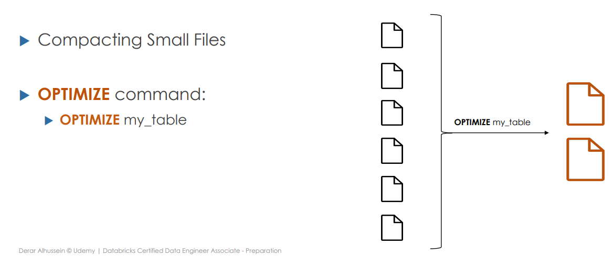

**2. Indexing in a Data Lake / Delta Lake Context**

Problem:

Even with Parquet + partitions, scans can still touch a lot of unnecessary data (files that don’t match filters).

Indexing techniques help by skipping useless data:

1. **Basic “indexing” already built into Delta/Parquet:**
    - **Partitioning** → skips entire folders (e.g., `date=2025-11-20`).
    - **File-level stats (min/max per column, null counts)** → engines read metadata first and **skip files** that can’t match a filter (`WHERE date='2025-11-20' AND amount > 1000`).
2. **Advanced indexing (conceptually):**
    - Some systems add **secondary indexes**, **data skipping indexes**, or **Bloom filters** to speed up point-lookups or selective filters.
    - Goal: **minimize the amount of data read** by using extra metadata structures.

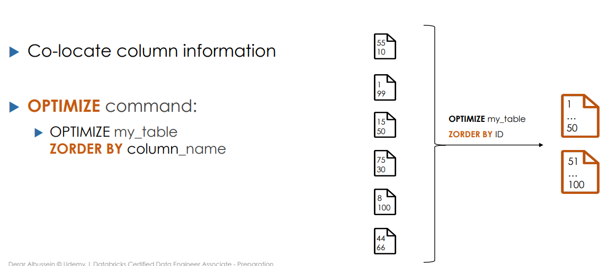

```sql
OPTIMIZE employees
ZORDER BY id
```

### **Vacuum**

In Delta Lake / Databricks, **`VACUUM`** is the feature that **permanently deletes old data files that are no longer referenced by the Delta transaction log**, to free up storage and keep the table tidy.

**Key points (brief & exam-style):**

- Every Delta operation (UPDATE, DELETE, MERGE, OPTIMIZE) creates **new files** and marks old ones as *removed* in the **Delta Log**, but the old files still physically exist in storage for **time travel** and safety.
- **`VACUUM` scans the Delta Log**, finds files that:
    - are **no longer referenced by any active table version**, and
    - are **older than the retention period** (default 7 days),
        
        and then **physically deletes** them from storage.
        
- Result:
    - **Reduces storage cost**
    - **Removes clutter** (less risk of “orphan” data)
    - Slightly improves metadata performance.

**Important caveat:**

Once a file is removed by `VACUUM`, you **cannot time-travel** to versions that depended on that file anymore.

```sql
## Cleaning up unused data files
VACUUM employees
%fs ls 'dbfs:/user/hive/warehouse/employees'
VACUUM employees RETAIN 0 HOURS # This will not work since the minimum defualt is 7 days 

## However we can remove the 7 days condition
SET spark.databricks.delta.retentionDurationCheck.enabled = false;
VACUUM employees RETAIN 0 HOURS # Now this will work
%fs ls 'dbfs:/user/hive/warehouse/employees'

## Dropping Tables
DROP TABLE employees
SELECT * FROM employees
%fs ls 'dbfs:/user/hive/warehouse/employees'
```

 

## Data File Layout

- The organization and storage structure of the underlying data files
that make up a Delta table.
- Optimizing layout helps leveraging data-skipping algorithms
- Optimization techniques:
    - Partitioning
    - Z-Order Indexing
    - Liquid Clustering

### Partitioning

Organizing a table by grouping rows that share the same values for
predefined partitioning columns

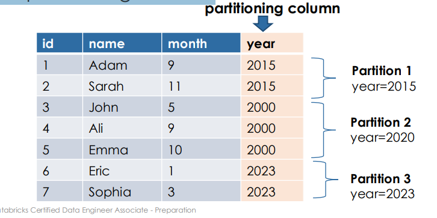

**Partitioning Delta Lake Tables**

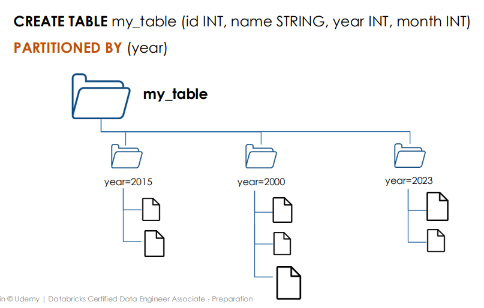

**Partition Skipping**

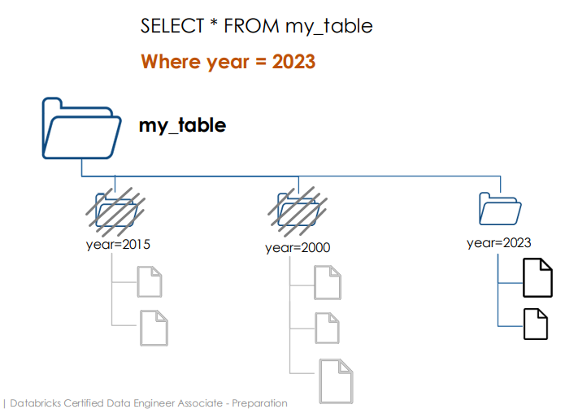

**Partitioning Limitations**

- Prevents file compaction across partition boundaries
    - Results in a small files problem
- Inefficient for high-cardinality columns
    - Results in a small files problem
- Static: Re-prartitioning requires a full table rewrite

### Z-Order Indexing

- Group similar data into optimized files
without creating directories.
- Leverage data-skipping algorithms.
- Effective for High-cardinality columns.

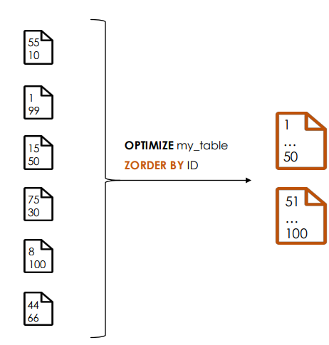

**Z-Ordering: Not Incremental**

- Z-Ordering is not an incremental operation.
- when new data is ingested then the z-ordering command will reorganize all the table which can be computational expensive

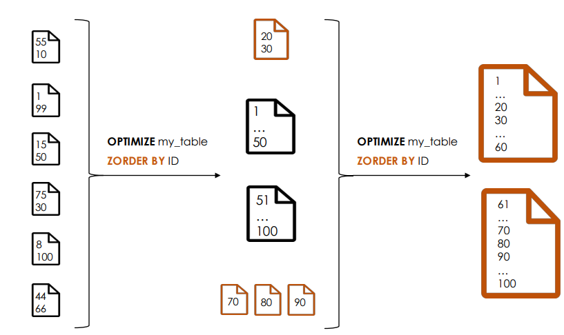

### Liquid Clustering

- Improved version of Z-order indexing with more flexibility and better performance.
- Table-level definition
    - New tables:
        
        ```sql
        CREATE TABLE table1(col1, INT, col2 STRING, col3 DATE) CLUSTER BY (col1, col3)
        ```
        
    - Existing tables:
        
        ```sql
        ALTER TABLE table2 CLUSTER BY (<clustering_columns>)
        ```
        
- Clustering is not compatible with partitioning or ZORDER

**Incremental Clustering**

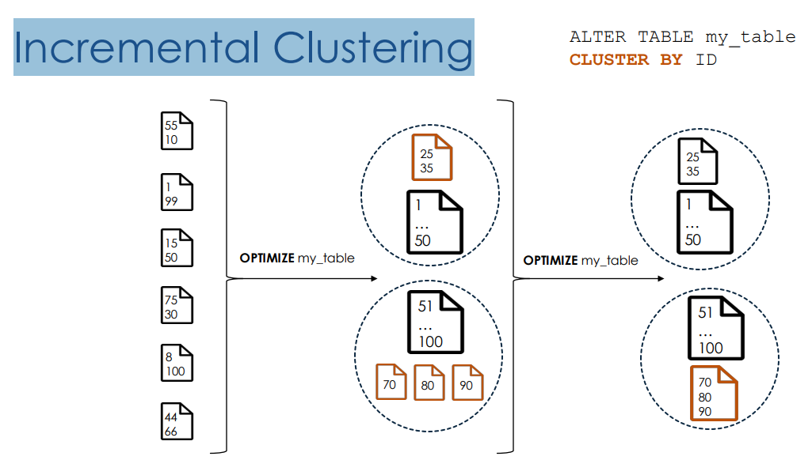

**Choosing Clustering Keys**

- Flexible to redefine clustering keys without rewriting existing data
- Choose clustering keys based on your query pattern

**Automatic Liquid Clustering**

- Databricks automatically chooses clustering keys by analyzing the table historical
query workload.
- Requires Predictive Optimization on Unity Catalog managed tables.
- Syntax:
    - New Tables:
        
        ```sql
        CREATE TABLE table1(col1, INT, col2 STRING, col3 DATE) 
        CLUSTER BY AUTO
        ```
        
    - Existing Tables:
        
        ```sql
        ALTER TABLE table2 
        CLUSTER BY AUTO
        ```
        

## Relational Entities in Databricks

### Databases

In databricks, Databases = Schemas in Hive metastore

that is why to create a database we use:

```sql
CREATE DATABASE db_name
```

OR

```sql
CREATE SCHEMA db_name
```

Create a database in the default location:

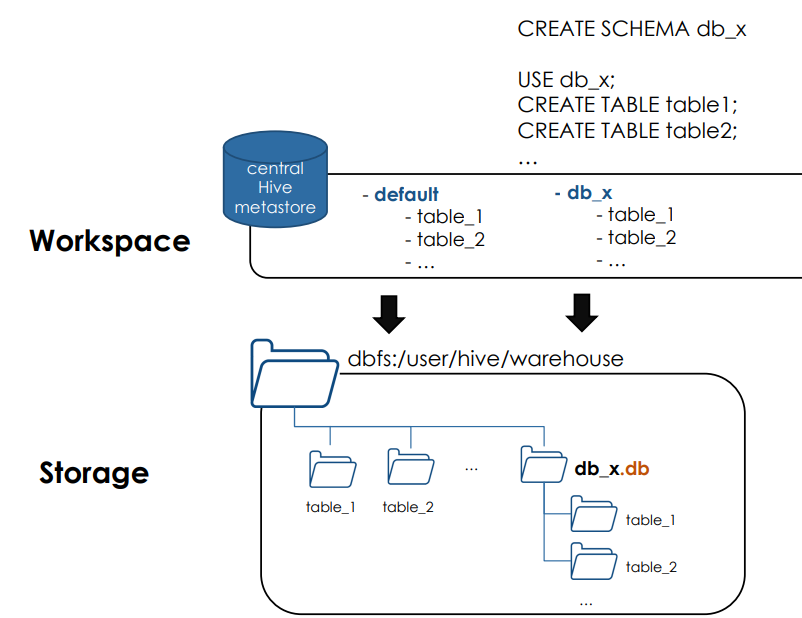

Create a database in a specific location:

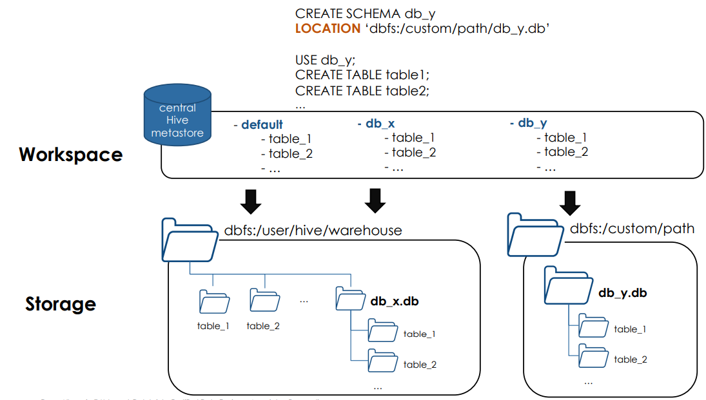

### Tables

### Managed Tables

Created under the database directory

Dropping the table, delete the underlying data files

```sql
CREATE TABLE table_name
```

### External Tables

Created outside the database directory

Dropping the table, will Not delete the underlying data files

```sql
CREATE TABLE table_name
LOCATION ‘path’
```

### Hands On

## Delta Tables

A **Delta table** is simply a table stored in the **Delta Lake format** on top of your data lake (S3, ADLS, GCS, etc.), which gives your files **database-like behavior**.

More concretely:

- Physically: it’s a **folder of Parquet files + a `_delta_log` directory** (the transaction log).
- Logically: it’s a **table** you query with SQL/Python like any other (e.g., `SELECT * FROM sales_delta`).

Key properties a *Delta table* has compared to plain Parquet:

- ✅ **ACID transactions** (safe concurrent reads/writes)
- ✅ **Schema enforcement & evolution**
- ✅ **Time travel** (query by version/timestamp)
- ✅ **Efficient deletes/updates/merges** (`DELETE`, `UPDATE`, `MERGE INTO`)
- ✅ **Unified batch + streaming** on the same table

### Create Table As Select (CTAS)

It’s a SQL pattern to **create a new table directly from the result of a query**.

### Concept

Instead of:

1. `CREATE TABLE ...`
2. `INSERT INTO ... SELECT ...`

You do it in **one step**:

```sql
CREATE TABLE sales_2024_delta
USING DELTA
AS
SELECT *
FROM sales_raw
WHERE year = 2024;
```

Automatically infer schema information from query results

- do not support manual schema declaration
- CTAS: Filtering and Renaming Columns

```sql
CREATE TABLE table_1
AS 
SELECT col_1, col_3 AS new_col_3 FROM table_2
```

- CTAS: Additional Options

```sql
CREATE TABLE new_table
COMMENT "Contains PII”
PARTITIONED BY (city, birth_date)
LOCATION ‘/some/path’
AS SELECT id, name, email, birth_date, city FROM users
```

### CREATE TABLE vs. CTAS

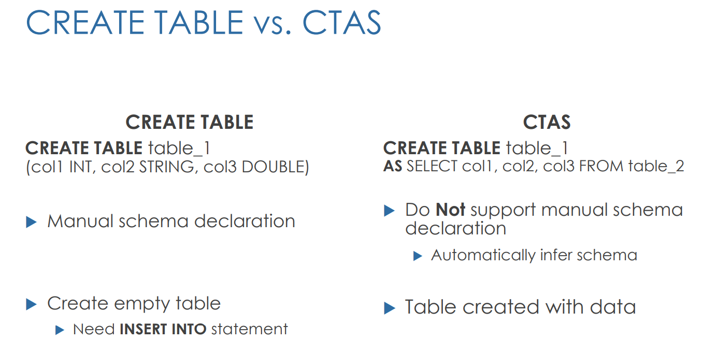

### Table Constraints

In Databricks, **table constraints** are rules you attach to a table to keep the data **valid and consistent**. 

Think of them as “guardrails” enforced at the table level.

At a high level, they:

- Define what values are **allowed** in a column or set of columns.
- Are checked when you **insert, update, or merge** data.
- Help prevent **bad / inconsistent data** from entering your Delta tables.

### 1. NOT NULL constraint

Ensures a column **cannot be NULL**.

```sql
CREATE TABLE customers (
  customer_id   BIGINT NOT NULL,
  name          STRING NOT NULL,
  email         STRING
) USING DELTA;

```

If you try to insert a row with `customer_id = NULL`, the operation fails.

2. CHECK constraint
A **boolean condition** that must be true for every row.

```sql
CREATE TABLE orders (
  order_id   BIGINT NOT NULL,
  amount     DECIMAL(10,2),
  status     STRING,
  CONSTRAINT valid_amount CHECK (amount >= 0),
  CONSTRAINT valid_status CHECK (status IN ('NEW','SHIPPED','CANCELLED'))
) USING DELTA;
```

If a row violates the condition (e.g., `amount = -5`), the write is rejected.

You can also add them later:

```sql
ALTER TABLE orders
ADD CONSTRAINT valid_amount CHECK (amount >= 0);
```

### 3. PRIMARY KEY / UNIQUE / FOREIGN KEY (logical vs enforced)

Databricks **Unity Catalog** lets you **define** primary/unique/foreign keys, but today they are mainly:

- Used as **metadata / documentation** and for some optimizer features.
- Not always *fully enforced* like in a traditional OLTP database (this is evolving, but for exam / mental model, treat them as “constraints with limited enforcement”).

Example:

```sql
ALTER TABLE customers
ADD CONSTRAINT pk_customers PRIMARY KEY (customer_id);
```

### 4. Default expressions (not exactly a “constraint”, but related)

You can set **default values** for columns, which help maintain consistency:

```sql
CREATE TABLE events (
  id        BIGINT,
  created_at TIMESTAMP DEFAULT current_timestamp()
) USING DELTA;
```

### Why Databricks cares about constraints

- Improve **data quality** in your Lakehouse.
- Help **optimizers** reason about the data (e.g., filters that are always true / false).
- Make Delta tables behave more like a **proper database**, not just “files”.

### Cloning Delta Tables

**`CLONE` in Databricks is really a Delta Lake feature**, not a generic “copy any table” thing.

### 1. Core idea: cloning is a **Delta Lake trick**

In Databricks, when you see:

```sql
CREATE TABLE target_shallow SHALLOW CLONE source_delta;
CREATE TABLE target_deep DEECLONE source_delta SHALLOW;
```

you’re using a **Delta feature** that relies on:

- The **Delta transaction log** (`_delta_log`)
- The fact that data is stored as **files in object storage**

This lets Databricks create:

- **Shallow clone** → new table **reuses the same data files**, only metadata/log differ.
- **Deep clone** → new table **copies data files** (& log) to a new location.

Both clones are **snapshots of a given Delta version**.

Non-Delta formats (plain Parquet, CSV, etc.) **don’t have Delta logs**, so Databricks can’t do this smart snapshotting in the same way.

### 2. Why cloning Delta tables is “special”

Cloning works so well for Delta tables because:

1. **Versioned snapshots via the Delta log**
    - You can clone **as of a specific version or timestamp**:
        
        ```sql
        CREATE TABLE backup_sales_shallow
        SHALLOW CLONE sales_delta VERSION AS OF 42;
        ```
        
    - This is basically “give me a new table that points to the state of `sales_delta` at version 42”.
2. **Zero-copy metadata-only clone (shallow)**
    - For a *shallow clone*, Databricks doesn’t copy data files:
        - It creates a new Delta table with its own `_delta_log`.
        - The `add` actions in that log point to the **same underlying Parquet files**.
    - Super fast, cheap in storage → ideal for **experiments, dev/test, backups**.
3. **Deep clone uses lake semantics + log**
    - For a *deep clone*, Databricks:
        - Reads which files belong to the chosen snapshot.
        - Copies those files to a new location.
        - Creates a new `_delta_log` for the clone.
    - Result: **independent physical copy** of the table.
4. **Incremental behavior**
    - Deep clone can (in some scenarios) copy **only changed files** since last clone, thanks to the log’s knowledge of versions.

None of this is natively possible with just “dumb files” (plain Parquet/CSV) that lack a transaction log and versioned metadata.

### 3. So why is cloning *non-Delta* different / limited?

For **non-Delta tables** (e.g., Parquet without Delta log):

- There is **no transaction log** describing:
    - versions,
    - which files belong to which snapshot,
    - what changed between versions.
- So Databricks can’t:
    - Snapshot **as of a version** (no versioning).
    - Do a true **zero-copy shallow clone based on table-level metadata**.
    - Track incremental changes for smart deep clones.

In practice, “cloning” a non-Delta table usually degenerates into a **simple copy** (CTAS or manual copy of files), which:

- is slower,
- doesn’t support time travel,
- doesn’t give you the same snapshot semantics.

### 4. Conceptual summary you can reuse

> Cloning is fundamentally a Delta Lake feature.
> 
> 
> A Delta table has a transaction log that tracks all files for each version.
> 
> - **Shallow clone** = create a new Delta table whose log points to the **same data files** (zero-copy snapshot).
> - **Deep clone** = copy the data files & log to a new location, giving a **fully independent table**.
>     
>     Non-Delta tables don’t have a Delta log or versions, so they can’t support this efficient, versioned cloning behavior; at best you just copy data without time-travel or snapshot semantics.
>     

If you want, next I can draw a small diagram: *original Delta table* → *shallow clone* → *deep clone*, showing

## Views

Think of a **view** as a *saved query*, not a place where data lives.

- **What is a View?**
    - A **view** is a **named SQL query** stored in the metastore.
    - When you do:
    
    ```sql
    CREATE VIEW high_value_orders AS
    SELECT *
    FROM orders
    WHERE amount > 1000;
    ```
    
    you’re not storing new data; you’re storing **the definition** of that query.
    
    Then you can:
    
    ```sql
    SELECT * FROM high_value_orders;
    ```
    
    and the engine simply runs the underlying query on `orders` every time.
    
    So:
    
    - **Table** → stores **data** (physical storage: files, Delta, etc.).
    - **View** → stores **logic** (a SQL statement).
- **Why is a view different from a table?**
    
    **Table**
    
    - Has **physical storage** (Parquet/Delta files, etc.).
    - Data is **materialized** and stays there until changed.
    - Insert/update/delete **change the stored data**.
    
    **View**
    
    - Has **no independent storage** (for a “normal” view).
    - Always **reads data from underlying tables** when queried.
    - Changing the view definition only changes the **SQL logic**, not the underlying data.
    
    *(Materialized views are a special case where the result is stored, but that’s another topic.)*
    
- **Why use a view instead of querying the table directly?**
    
    **3.1. Reuse of complex logic**
    
    If you have a long, ugly query with joins, filters, derived columns, etc.:
    
    ```sql
    SELECT ...
    FROM a
    JOIN b ON ...
    JOIN c ON ...
    WHERE business_rules...
    ```
    
    You can hide it behind a view:
    
    ```sql
    CREATE VIEW business_facts AS
    SELECT ...
    FROM a
    JOIN b ...
    JOIN c ...
    WHERE business_rules...;
    ```
    
    Then downstream people just do:
    
    ```sql
    SELECT * FROM business_facts WHERE country = 'US';
    ```
    
    ✅ Less code duplication
    
    ✅ Fewer mistakes rewriting the same logic
    
    **3.2. Abstraction / decoupling**
    
    If the **underlying tables change** (new columns, different joins, partitioning, etc.):
    
    - You update the **view definition**.
    - All users/tools querying the view **keep using the same name and columns**.
    
    The view acts as a **stable contract** between data producers and consumers.
    
    **3.3. Security & governance**
    
    You can:
    
    - Grant access to a **view** but not to the **base table**.
    - The view can **hide sensitive columns** or **pre-filter rows**:
    
    ```sql
    CREATE VIEW public_customer_view AS
    SELECT customer_id, city, country
    FROM customers;
    -- No email, phone, etc.
    
    ```
    
    Then give analysts access only to `public_customer_view`.
    
    ✅ Row / column level security patterns
    
    ✅ Principle of least privilege
    
    **3.4. Performance patterns (sometimes)**
    
    - You can build views that **pre-apply filters** or **standard joins** that are known to be efficient.
    - The optimizer can often **inline** the view definition, so you don’t lose performance, but you gain readability and consistency.
- **Short answer you can reuse**
    
    > A view is a named, virtual table defined by a SQL query.
    > 
    > 
    > Unlike a table, a view doesn’t store data; it always reads from underlying tables when queried.
    > 
    > Using views is convenient because they:
    > 
    > - Reuse and centralize complex logic,
    > - Provide a stable interface even if base tables change,
    > - Enable security by exposing only specific columns/rows,
    > - Make queries simpler and less error-prone.
- **Hands ON**
