# 2. ELT with Spark SQL and Python

# Data Processing and Transformation

## Querying Files

### 1. What is “querying files”?

Instead of:

```sql
SELECT * FROM main.sales.orders;
```

you read the data straight from storage, for example:

```sql
-- Path-based read using a format
SELECT *
FROM delta.`s3://depts/finance/forecast_delta_table`;
```

This pattern is explicitly supported in Databricks SQL: the *table reference* is a **format + file path**, not a registered table

With Unity Catalog, there’s also the **`READ FILES` privilege**, which allows a user to *query files directly* via a storage credential or external location (for example, S3 or ADLS paths), even when no table exists.

Newer runtimes add a table-valued function specifically for this:

```sql
SELECT * 
FROM read_files('s3://raw-bucket/clickstream/2025/12/01/*.json');
```

`read_files()` reads all files under a location and returns them as a table-like result, auto-detecting formats such as JSON, CSV, Parquet, ORC, etc. [Databricks Documentation+1](https://docs.databricks.com/aws/en/sql/language-manual/functions/read_files?utm_source=chatgpt.com)

In PySpark, it’s the same idea conceptually:

```sql
df = (spark.read
          .format("json")
          .load("s3://raw-bucket/events/*.json"))
```

You’re not tied to any metastore object; you’re directly reading files.

### 2. Why is this important (especially for the exam)?

**a) First step of ingestion / bronze layer**

Most pipelines start with **raw files in cloud storage**. Before you create Delta tables, you:

1. **Query files** to inspect schema, quality, and content.
2. Transform/clean.
3. Write the result into **Delta tables** in your bronze/silver layers.

The exam expects you to understand that **raw → files, curated → tables**, and that you must be comfortable reading directly from those raw files.

**b) Flexibility for ad-hoc exploration & debugging**

Querying files lets you:

- Quickly inspect a new drop (`.csv`, `.json`, `.parquet`) without registering anything.
- Debug pipelines by reading the **exact files** in a problem folder.
- Explore one-off historical data that you don’t want to keep as a table.

This is much faster operationally than defining tables for every temporary dataset.

**c) Security & governance with Unity Catalog**

Under Unity Catalog:

- **Tables/views** are governed by `SELECT` on the table + `USAGE` on catalog/schema.
- **Files** are governed by `READ FILES` on a *storage credential* or *external location*, again with `USAGE` where appropriate. [Databricks Documentation+1](https://docs.databricks.com/aws/en/sql/language-manual/sql-ref-privileges-hms?utm_source=chatgpt.com)

The exam can test that distinction:

- *“Which privilege is needed to query files directly in an external location?”* → **`READ FILES`** (plus `USAGE` on the catalog/schema and external location).
- *“Which privilege do you use to query a table?”* → **`SELECT`**.

So “querying files” is not only a technical topic but a **governance** topic.

**d) Performance & best practices**

Why not just query files forever and forget about tables?

- Repeatedly querying raw files **bypasses Delta’s optimizations** (transaction log, statistics, clustering, data skipping, etc.), which are designed for **tables**. [Databricks Documentation+1](https://docs.databricks.com/aws/en/delta/?utm_source=chatgpt.com)
- You also lose table-level features: constraints, time travel, change data feed, predictive optimization, etc.

So typical **best practice** (and exam mental model):

1. **Query files** for:
    - Raw ingestion
    - Exploration
    - One-off diagnostic tasks
2. **Convert to Delta tables** (managed or external) for:
    - Production workloads
    - BI / dashboards
    - Long-term, governed storage

## Simplified File Querying

In the **Databricks Data Engineer** context, you can think of **“simplified file querying”** as:

> Querying files directly from cloud storage with very simple SQL, without first creating a table or writing complex Spark code.
> 

Concretely, it usually means two related patterns:

### 1. Querying by path with the `format.\`path`` syntax

Example with a Unity Catalog volume:

```sql
SELECT *
FROM json.`/Volumes/main/raw/landing/events/2025/12/01/`;

```

- `json` = file format
- ``/Volumes/...`` = path to files (backed by S3/ADLS/GCS)
- You get a **table-like result** without any `CREATE TABLE`.

This is exactly the “query data by path” pattern from the Databricks docs. [Databricks Documentation+1](https://docs.databricks.com/aws/en/query/?utm_source=chatgpt.com)

### 2. Using the `read_files()` table-valued function

Newer runtimes add **`read_files()`**, which is even more “simplified”:

```sql
SELECT *
FROM read_files('/Volumes/main/raw/landing/events/2025/12/01/');

```

- Databricks **infers the file format and schema** across many files (JSON, CSV, Parquet, Avro, ORC, XML, etc.). [Databricks Documentation+1](https://docs.databricks.com/aws/en/sql/language-manual/functions/read_files?utm_source=chatgpt.com)
- You can pass options like you would with `spark.read`.

This is heavily used with **streaming tables + Auto Loader**:

```sql
CREATE OR REFRESH STREAMING TABLE bronze_events
AS
SELECT *
FROM read_files('/Volumes/main/raw/landing/events/');
```

Here you’re directly ingesting from files into a streaming table using a single SQL statement. [Databricks Documentation+1](https://docs.databricks.com/aws/en/ldp/dbsql/streaming?utm_source=chatgpt.com)

### Why this matters (for you and for the exam)

1. **Faster ingestion & exploration**
    - You can **inspect raw files** quickly (new drop from a source system, one folder, one partition) without defining an external table.
2. **Key exam pattern**
    - Questions about **“querying data by path”**, **Unity Catalog volumes**, and **`read_files()`** are all basically testing this idea:
        - *“How do you read raw files from object storage into your pipeline using SQL?”*
3. **Governance angle**
    - Access to these files is governed via **Unity Catalog volumes** and permissions like `READ FILES` on external locations/volumes, instead of `SELECT` on a table. [Databricks Documentation+1](https://docs.databricks.com/aws/en/query/?utm_source=chatgpt.com)
4. **Still just the first step**
    - Best practice is **not** to keep querying raw files forever. You:
        1. Use simplified file querying (`format.\`path``or`read_files`) to read raw files.
        2. **Write to Delta tables** (bronze/silver) for long-term, optimized, governed access.

## Writing to Tables Theory

Let’s build the mental model for **“writing tables”** in Databricks, contrasting:

1. **Create table *from data* (querying files)**
2. **Create table *as a schema* (no files at creation time)**

### 0. Big picture

On Databricks today:

- **Tables = Delta by default** and Databricks recommends **Unity Catalog managed tables** for most use cases. [Databricks Documentation+1](https://docs.databricks.com/aws/en/delta/tutorial?utm_source=chatgpt.com)
- You usually end up with a table via one of two patterns:

> Pattern A – CTAS: CREATE TABLE ... AS SELECT ... (often reading from files)
> 
> 
> **Pattern B – Schema-only:** `CREATE TABLE ... (cols...) USING DELTA` then `INSERT ...`
> 

### 1. Writing tables *by querying files* (CTAS from files)

Here you **ingest and create the table in one shot**.

**Typical SQL pattern**

```sql
CREATE OR REPLACE TABLE bronze_events
AS
SELECT
  *
FROM read_files('/Volumes/main/raw/events/');
```

- `read_files()` reads files under a location and returns a table-like result (auto-detects many formats, infers schema). [Databricks Documentation+1](https://docs.databricks.com/aws/en/sql/language-manual/functions/read_files?utm_source=chatgpt.com)
- You can also query by path with `json.\`path``,` csv.`path``,` delta.`path`` etc. [Microsoft Learn](https://learn.microsoft.com/en-us/azure/databricks/query/formats/csv?utm_source=chatgpt.com)

So CTAS from files is:

> Files in cloud storage → SELECT (often with some transforms) → new Delta table
> 
> 
> 
> **Pros (why we like this)**
> 
> - **Fast ingestion**: perfect for building **bronze** tables from raw files.
> - **Minimal code**: one SQL statement does read + write.
> - **Good for exploration**: spin up throwaway tables for analysis or POC.
> 
> **Cons & exam-type details**
> 
> - With **CTAS** you **cannot** define things like identity columns, check constraints, or detailed table specs in the same statement. [Databricks Documentation+1](https://docs.databricks.com/aws/en/delta/generated-columns?utm_source=chatgpt.com)
> - Schema is mostly driven by the input (inferred or existing).
> - If you care about strict modeling & governance, you usually follow up with another step or use Pattern B.

### 2. Writing tables *without querying files* (schema-first)

Here you **define the table as a contract** (schema + properties) and load data later.

**Managed table example (no LOCATION)**

```sql
CREATE TABLE silver_orders (
  order_id      BIGINT,
  customer_id   BIGINT,
  order_ts      TIMESTAMP,
  order_date    DATE GENERATED ALWAYS AS (date(order_ts)),
  total_amount  DECIMAL(18,2),
  status        STRING,
  CONSTRAINT valid_amount CHECK (total_amount >= 0)
)
USING DELTA
PARTITIONED BY (order_date);
```

- This creates a **Unity Catalog managed table** (metadata + data fully managed by Databricks). [Databricks Documentation+1](https://docs.databricks.com/gcp/en/tables/managed?utm_source=chatgpt.com)
- No data is written yet.

Then you load data:

```sql
INSERT INTO silver_orders
SELECT
  order_id,
  customer_id,
  order_ts,
  -- order_date is generated
	total_amount,
	  status
FROM bronze_orders;
```

You could also insert directly from `read_files()` instead of another table.

### External table example (schema-first with LOCATION)

```sql
CREATE TABLE ext_reporting.orders_external (
  order_id BIGINT,
  ...
)
USING DELTA
LOCATION 's3://company-data/reporting/orders/';
```

- An **external table** references a specific storage path via `LOCATION`; data lifecycle/layout is controlled outside Databricks, while UC manages access. [Databricks Documentation+2Microsoft Learn+2](https://docs.databricks.com/aws/en/sql/language-manual/sql-ref-external-tables?utm_source=chatgpt.com)

### Pros

- Full control over:
    - **Schema** (types, names)
    - **Constraints** (CHECK, NOT NULL)
    - **Generated/identity columns**, partitioning, table properties. [Databricks Documentation+1](https://docs.databricks.com/aws/en/delta/generated-columns?utm_source=chatgpt.com)
- Clean separation of **data model** vs **data load**.
- Better for **long-term, production tables** (governance, contracts, BI).

### Cons

- Slightly more verbose (need CREATE + INSERT).
- You must handle schema evolution explicitly.

### 3. So… when use which?

**Use CTAS from files when:**

- You are building **landing / bronze tables** from raw CSV/JSON/Parquet.
- You want a **quick one-shot load**:
    
    ```sql
    CREATE TABLE bronze_customers AS
    SELECT * FROM read_files('/Volumes/raw/customers/');
    ```
    
- You’re doing **experimental / ad-hoc** work and don’t need fancy constraints.

**Use schema-first CREATE TABLE when:**

- The table is **core to your model** (silver/gold, shared across teams).
- You need:
    - Constraints
    - Generated / identity columns
    - Specific partitioning
    - Fine-grained properties (e.g., retention, comments).
- Data may come from **multiple sources** (files + other tables + streams over time).

### 4. Quick exam-style hooks to remember

You don’t need full questions now, just mental anchors:

- **“Which statement lets you load data and create the table in one command?”**
    
    → `CREATE TABLE ... AS SELECT ...` (**CTAS**, often from files).
    
- **“You must define an identity column and CHECK constraints—what pattern?”**
    
    → Create table **first with schema**, then **INSERT** (CTAS can’t define these). [Databricks Documentation+1](https://docs.databricks.com/aws/en/delta/generated-columns?utm_source=chatgpt.com)
    
- **“Dropping a managed table vs an external table?”**
    
    → Managed: Databricks deletes data + metadata.
    
    → External: Databricks drops only metadata; data at LOCATION remains. [Databricks Documentation+2Microsoft Learn](https://docs.databricks.com/gcp/en/tables/managed?utm_source=chatgpt.com)
    

## Writing to Tables Hands On

## Advanced Transformations

When Databricks talks about **“advanced transformations”**, they basically mean everything **beyond** `SELECT / WHERE / simple GROUP BY`. For the exam, the big buckets are:

### **1. Advanced joins & optimizations**

**Concept:** Combine datasets efficiently, avoiding huge shuffles when possible.

Key things to know:

- **Join types:** `inner`, `left`, `right`, `full`, `left_semi`, `left_anti`, `cross`.
    - Inner Join
        
        An **inner join** returns only the rows where the join condition matches in **both** tables.
        
        Rows with keys that exist in one table but not the other are **excluded** from the result. 
        
        It’s essentially the intersection of the two tables based on the join keys.
        
        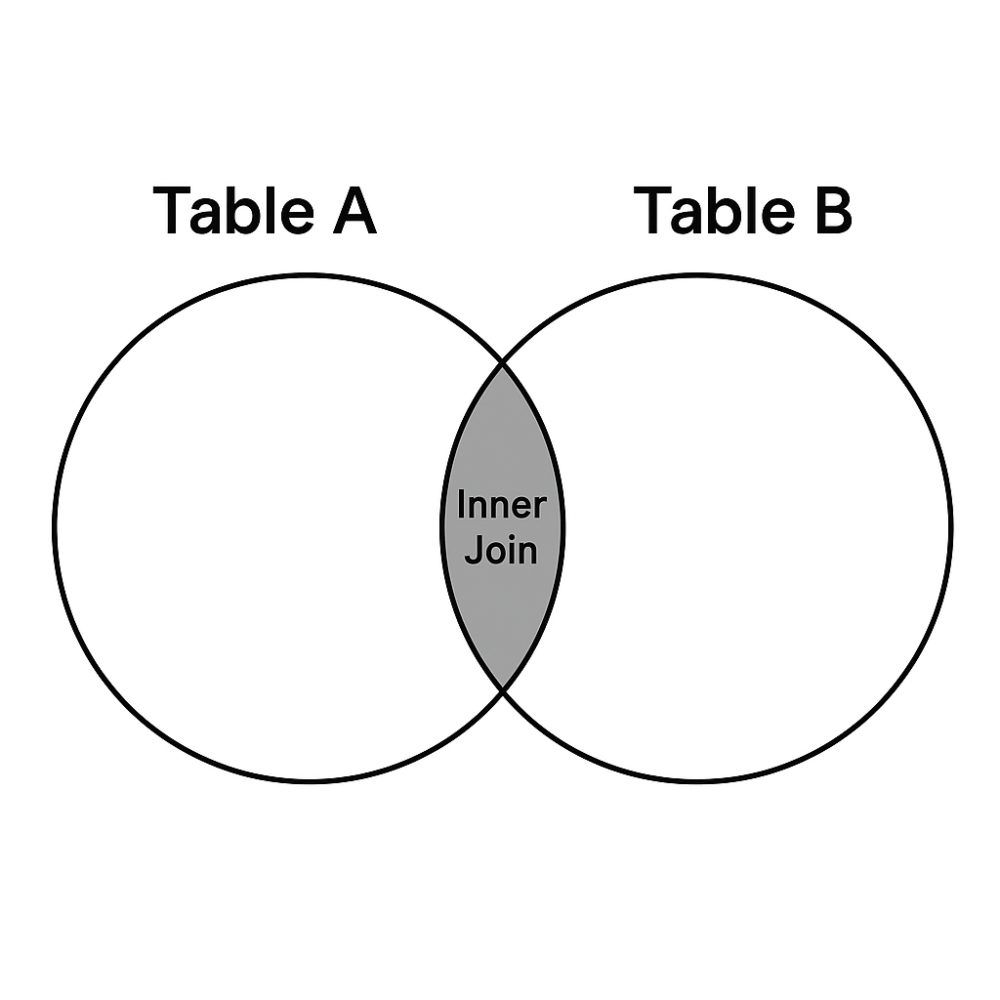
        
        Example:
        
        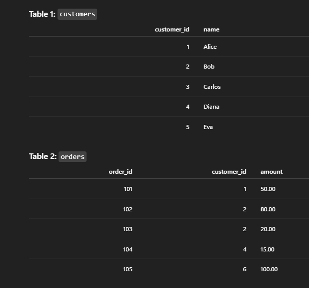
        
        ```python
        # Customers DataFrame
        customers = [
            (1, "Alice"),
            (2, "Bob"),
            (3, "Carlos"),
            (4, "Diana"),
            (5, "Eva"),
        ]
        df_customers = spark.createDataFrame(customers, ["customer_id", "name"])
        
        # Orders DataFrame
        orders = [
            (101, 1, 50.00),
            (102, 2, 80.00),
            (103, 2, 20.00),
            (104, 4, 15.00),
            (105, 6, 100.00),
        ]
        df_orders = spark.createDataFrame(orders, ["order_id", "customer_id", "amount"])
        
        # INNER JOIN on customer_id
        df_inner = df_customers.join(df_orders, on="customer_id", how="inner")
        
        display(df_inner)
        ```
        
        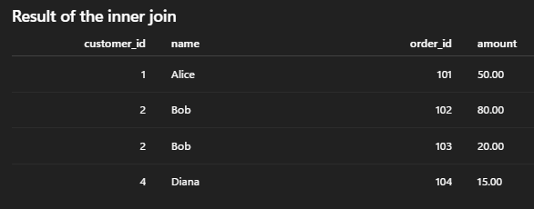
        
    - Left Join
        
        A **left join** returns **all rows from the left table** and the **matching rows from the right table**. 
        
        If there is no match on the join key, the left row is kept and the right-side columns are filled with **NULL**. 
        
        Think: “keep everyone from the left, enrich with data from the right when possible.”
        
        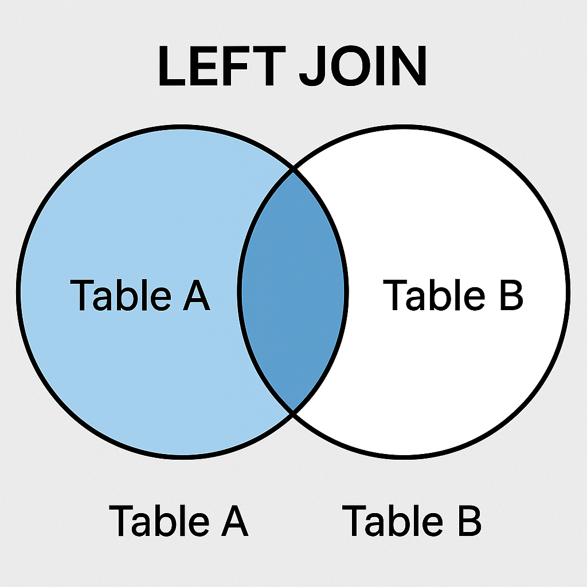
        
        Example
        
        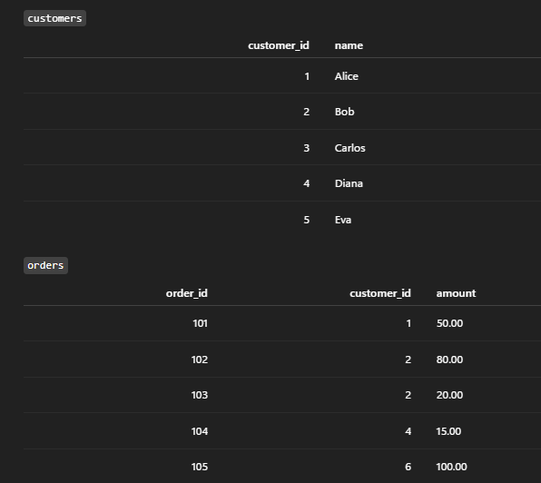
        
        ```python
        # Customers DataFrame
        customers = [
            (1, "Alice"),
            (2, "Bob"),
            (3, "Carlos"),
            (4, "Diana"),
            (5, "Eva"),
        ]
        df_customers = spark.createDataFrame(customers, ["customer_id", "name"])
        
        # Orders DataFrame
        orders = [
            (101, 1, 50.00),
            (102, 2, 80.00),
            (103, 2, 20.00),
            (104, 4, 15.00),
            (105, 6, 100.00),
        ]
        df_orders = spark.createDataFrame(orders, ["order_id", "customer_id", "amount"])
        
        # LEFT JOIN: keep all customers, match orders when they exist
        df_left = df_customers.join(df_orders, on="customer_id", how="left")
        
        display(df_left.orderBy("customer_id", "order_id"))
        ```
        
        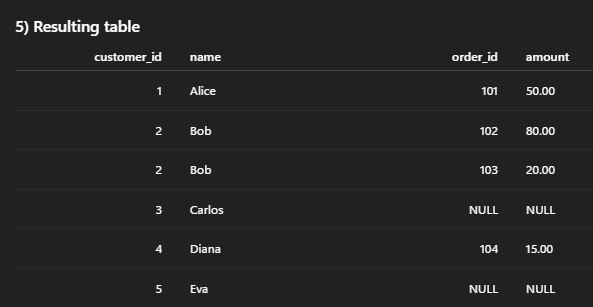
        
    - Right Join
        
        A **right join** returns **all rows from the right table** and only the **matching rows from the left table** . 
        
        Rows from the right table that don’t find a match keep their values, while left-table columns become **NULL**. 
        
        Think: “keep everyone from the right, enrich with data from the left when possible.”
        
        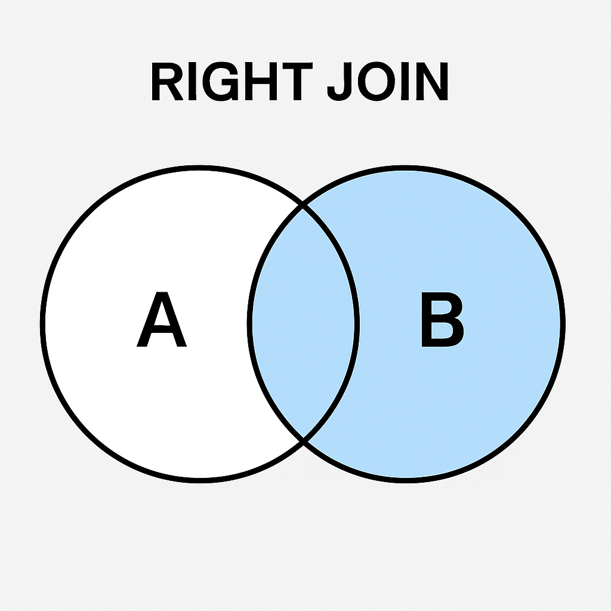
        
        Example
        
        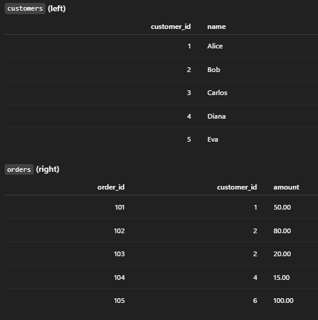
        
        ```python
        # Customers DataFrame (left)
        customers = [
            (1, "Alice"),
            (2, "Bob"),
            (3, "Carlos"),
            (4, "Diana"),
            (5, "Eva"),
        ]
        df_customers = spark.createDataFrame(customers, ["customer_id", "name"])
        
        # Orders DataFrame (right)
        orders = [
            (101, 1, 50.00),
            (102, 2, 80.00),
            (103, 2, 20.00),
            (104, 4, 15.00),
            (105, 6, 100.00),
        ]
        df_orders = spark.createDataFrame(orders, ["order_id", "customer_id", "amount"])
        
        # RIGHT JOIN: keep all orders, match customers when they exist
        df_right = df_customers.join(df_orders, on="customer_id", how="right")
        
        display(df_right.orderBy("customer_id", "order_id"))
        ```
        
        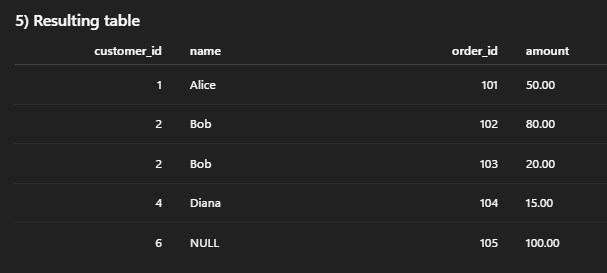
        
    - Full Join
        
        A **full join** (full outer join) returns **all rows from both tables**.
        
        - Matching keys → one combined row (or more, if many-to-many).
        - Keys only in the left table → right columns are **NULL**.
        - Keys only in the right table → left columns are **NULL**.
            
            Think: union of **left join + right join**.
            
        
        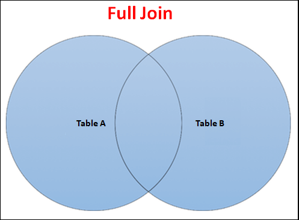
        
        Example
        
        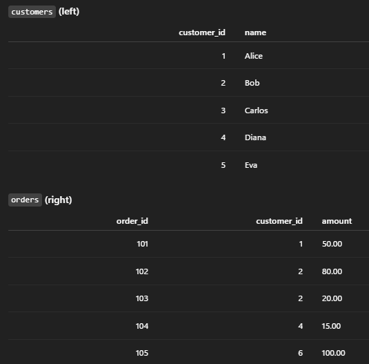
        
        ```python
        # Customers DataFrame (left)
        customers = [
            (1, "Alice"),
            (2, "Bob"),
            (3, "Carlos"),
            (4, "Diana"),
            (5, "Eva"),
        ]
        df_customers = spark.createDataFrame(customers, ["customer_id", "name"])
        
        # Orders DataFrame (right)
        orders = [
            (101, 1, 50.00),
            (102, 2, 80.00),
            (103, 2, 20.00),
            (104, 4, 15.00),
            (105, 6, 100.00),
        ]
        df_orders = spark.createDataFrame(orders, ["order_id", "customer_id", "amount"])
        
        # FULL (OUTER) JOIN: keep all customers and all orders
        df_full = df_customers.join(df_orders, on="customer_id", how="outer")
        
        display(df_full.orderBy("customer_id", "order_id"))
        ```
        
        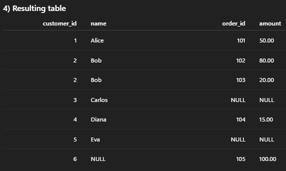
        
    - Left_semi Join
        
        A **left semi join** returns **only rows from the left table** where there is **at least one matching row in the right table**. 
        
        It behaves like an Exits filter: *“keep customers that have at least one order”*.
        
        Only columns from the left table appear in the result, and each left row appears at most once (even if multiple matches on the right).
        
        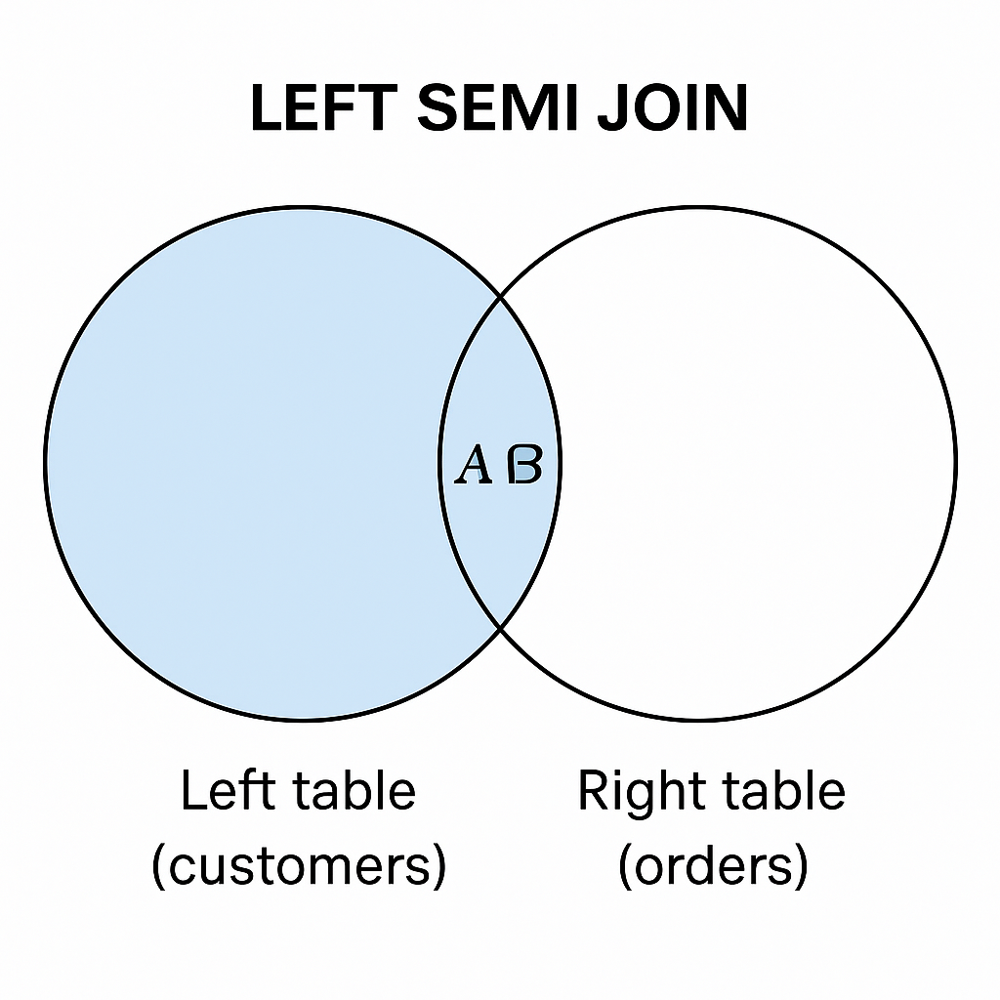
        
        Conceptually:
        
        - **LEFT JOIN** → all keys from the left circle (matched + unmatched).
        - **LEFT SEMI JOIN** → **only** the keys in the *overlap* (A ∩ B), but we return **only left-table columns**.
        
        A pure Venn of **keys** for left-semi and an inner join will both shade the overlap, because they both keep the matching keys. The difference is in the **resulting columns and row multiplicity**:
        
        - `INNER JOIN` → left **and** right columns; duplicates when there are multiple matches.
        - `LEFT SEMI JOIN` → **only left columns**, and each left row appears at most once (acts like `WHERE EXISTS (…)`).
        
        Example 
        
        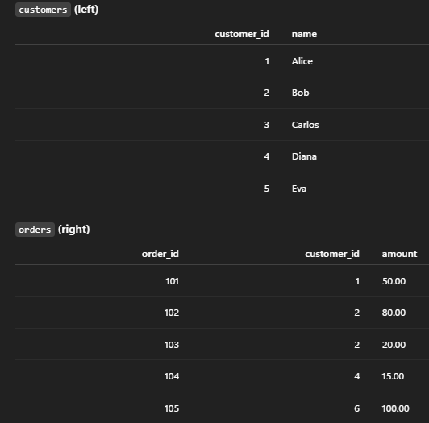
        
        ```python
        # Customers DataFrame (left)
        customers = [
            (1, "Alice"),
            (2, "Bob"),
            (3, "Carlos"),
            (4, "Diana"),
            (5, "Eva"),
        ]
        df_customers = spark.createDataFrame(customers, ["customer_id", "name"])
        
        # Orders DataFrame (right)
        orders = [
            (101, 1, 50.00),
            (102, 2, 80.00),
            (103, 2, 20.00),
            (104, 4, 15.00),
            (105, 6, 100.00),
        ]
        df_orders = spark.createDataFrame(orders, ["order_id", "customer_id", "amount"])
        
        # LEFT SEMI JOIN: keep only customers that have at least one order
        df_left_semi = df_customers.join(df_orders, on="customer_id", how="left_semi")
        
        display(df_left_semi.orderBy("customer_id"))
        ```
        
        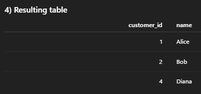
        
    - Left_anti Join
        
        A **left anti join** returns **only rows from the left table that have *no* matching row in the right table**. 
        
        It’s like WHERE NOT EXISTS (...) using the right table as the filter.
        
        Only columns from the left table appear in the result; right-table data is never shown.
        
        Think: *“give me customers that do NOT have any orders.”*
        
        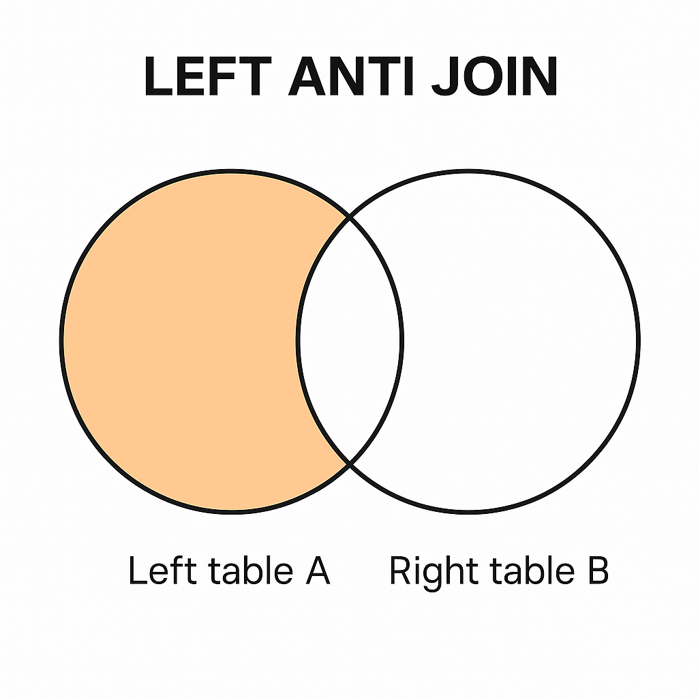
        
        Example
        
        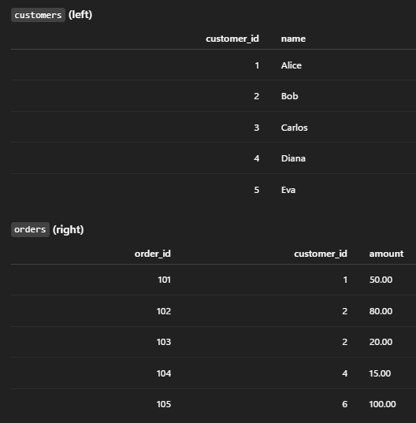
        
        ```python
        # Customers DataFrame (left)
        customers = [
            (1, "Alice"),
            (2, "Bob"),
            (3, "Carlos"),
            (4, "Diana"),
            (5, "Eva"),
        ]
        df_customers = spark.createDataFrame(customers, ["customer_id", "name"])
        
        # Orders DataFrame (right)
        orders = [
            (101, 1, 50.00),
            (102, 2, 80.00),
            (103, 2, 20.00),
            (104, 4, 15.00),
            (105, 6, 100.00),
        ]
        df_orders = spark.createDataFrame(orders, ["order_id", "customer_id", "amount"])
        
        # LEFT ANTI JOIN: customers that have NO orders
        df_left_anti = df_customers.join(df_orders, on="customer_id", how="left_anti")
        
        display(df_left_anti.orderBy("customer_id"))
        ```
        
        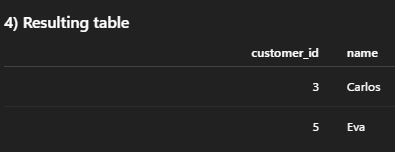
        
    - Cross Join
        
        A **cross join** returns the **Cartesian product** of both tables: every row from the left combined with every row from the right.
        
        There is **no join condition**; it ignores keys.
        
        If the left table has *m* rows and the right table has *n* rows, the result has *m × n* rows.
        
        In practice it’s used rarely and carefully, because it can explode row counts.
        
        Example:
        
        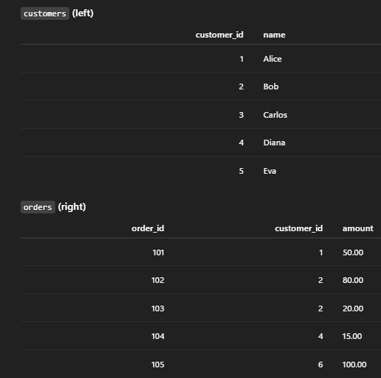
        
        ```python
        # Customers DataFrame
        customers = [
            (1, "Alice"),
            (2, "Bob"),
            (3, "Carlos"),
            (4, "Diana"),
            (5, "Eva"),
        ]
        df_customers = spark.createDataFrame(customers, ["customer_id", "name"])
        
        # Orders DataFrame
        orders = [
            (101, 1, 50.00),
            (102, 2, 80.00),
            (103, 2, 20.00),
            (104, 4, 15.00),
            (105, 6, 100.00),
        ]
        df_orders = spark.createDataFrame(orders, ["order_id", "customer_id", "amount"])
        
        # CROSS JOIN: Cartesian product (5 customers × 5 orders = 25 rows)
        df_cross = (
            df_customers.alias("c")
            .crossJoin(df_orders.alias("o"))
            .select("c.customer_id", "c.name", "o.order_id", "o.amount")
        )
        
        display(df_cross.orderBy("customer_id", "order_id"))
        ```
        
        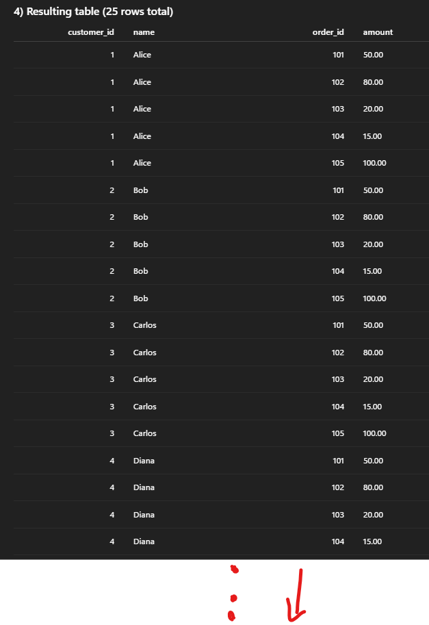
        
- **Broadcast joins:** Small table + big table → broadcast the small one.
    
    **1. Core idea**
    
    In a normal join, Spark must **shuffle** both tables across the cluster so matching keys end up on the same executor. Shuffles are expensive (disk, network, time).
    
    In a **broadcast join**:
    
    - Spark **copies the small table to every executor’s memory**.
    - Each executor then joins its partition of the big table with the *local* copy of the small table.
    - Result: **no shuffle of the big table** → much faster.
    
    **2. When is a broadcast join used?**
    
    Spark will automatically choose it when:
    
    - One side of the join is **“small enough”** (below a size threshold, e.g. ~10–100 MB; controlled by `spark.sql.autoBroadcastJoinThreshold`).
    - Or you **explicitly force it** with a hint.
    
    Typical pattern: **big fact table + small dimension table**.
    
    **3. How to use it (PySpark & SQL)**
    
    PySpark
    
    ```python
    from pyspark.sql.functions import broadcast
    
    df_joined = df_big.join(broadcast(df_small), on="id", how="inner")
    ```
    
    SQL
    
    ```sql
    SELECT /*+ BROADCAST(dim_customers) */
           f.*, d.region
    FROM fact_orders f
    JOIN dim_customers d
      ON f.customer_id = d.customer_id;
    ```
    
    **4. Trade-offs & pitfalls**
    
    - Good when **small table fits into executor memory**.
    - If the “small” table is actually large, broadcasting it can **blow up memory** and harm performance.
    - Great optimization for **star schemas** (fact + dimensions) and for joins against **reference tables** (e.g., country codes, product categories).
- **Skew handling (highly exam-relevant):**
    
    In Spark/Databricks many operations (joins, groupBy, window, etc.) do a **shuffle by key**.
    
    If some keys have **way more rows** than others (e.g., one customer with millions of orders, while others have a few), then:
    
    - One or a few partitions become **massive**.
    - One executor is stuck processing that partition while others finish early.
    - Job time is dominated by those “hot” partitions → **cluster under-utilised and slow**.
    
    That imbalance is **data skew**.
    
    - Skew happens when a few keys have **massive** amounts of data.
    - Typical tricks:
        - **Salting keys** (add random suffix to heavy keys before join).
        - Use **broadcast** when one side is small.

### **2. Window functions**

**Concept:** Do calculations **over a group of rows** without collapsing them like `GROUP BY` does.

Typical pattern:

```sql
SELECT
  customer_id,
  order_ts,
  total_amount,
  SUM(total_amount) OVER (
       PARTITION BY customer_id
       ORDER BY order_ts
       ROWS BETWEEN UNBOUNDED PRECEDING AND CURRENT ROW
  ) AS running_spend
FROM silver_orders;
```

Core window tricks for the exam:

- `row_number()` to pick **latest record per key** (dedup).
- `lag()` / `lead()` for **differences between rows** (e.g., sessionization, change detection).
- `sum() over (...)` for **running totals** and **moving averages**.
- Rank( )
- Dense Rank ( )
- AVG ( )
- MIN ( )
- MAX( )

Window = **“group” + “order” but keep all rows**.

### **3. Nested data & `explode` (arrays, structs, JSON)**

In real data (especially logs and event data), you’ll have **arrays / structs / JSON**.

You need to know how to **flatten** them.

```sql
SELECT
  e.user_id,
  e.event_ts,
  item.item_id,
  item.quantity
FROM bronze_events e
LATERAL VIEW EXPLODE(e.items) AS item;
```

Or in PySpark:

```python
from pyspark.sql.functions import explode, col

df_items = (df_events
    .withColumn("item", explode("items"))
    .select("user_id", "event_ts", "item.item_id", "item.quantity"))
```

Also important:

- `from_json()` + schema → parse JSON string columns.
- `to_json()` → serialize structures back to JSON.
- `get_field` syntax: `col("item")["price"]` or `item.price`.

### 4. **Pivot / unpivot & advanced aggregations**

**Pivot:** rows → columns (wide format).

```sql
SELECT *
FROM sales
PIVOT (SUM(amount) AS total
       FOR month IN ('Jan', 'Feb', 'Mar'));
```

Useful patterns:

- **Pivot** for “one row per entity, one column per category”.
- **Rollup / cube / grouping sets** (may appear conceptually in exam):
    - `GROUP BY ROLLUP(region, country)` → subtotals and grand totals.

These are “advanced” because they produce multi-level aggregated views.

### 5. **Higher-order functions on arrays & maps**

Databricks loves these because they are **SQL-friendly** and work on nested data.

On arrays:

```sql
SELECT
  user_id,
  transform(scores, s -> s * 1.1)  AS boosted_scores,
  filter(scores,   s -> s >= 80.0) AS high_scores,
  aggregate(scores, 0D, (acc, s) -> acc + s) AS total_score
FROM student_scores;
```

Key functions:

- `transform(array, x -> expr)`: map over elements.
- `filter(array, x -> predicate)`: keep some elements.
- `exists(array, x -> predicate)`: does any element satisfy condition?
- `aggregate(array, initial, (acc, x) -> expr[, finish])`: fold/reduce.

These are crucial when combining **semi-structured data** with SQL.

### **6. Putting it together (exam mindset)**

When you see a scenario like:

> “We receive nested JSON clickstream events in cloud storage, and we need a gold table with 1 row per user per day including running metrics…”
> 

Think:

1. **Read files** → bronze.
2. **Explode and parse nested structures** → flatten to events.
3. **Use window functions** → session boundaries, running counts, rankings.
4. **Aggregate / pivot** → daily user metrics table.
5. **Optimize joins** with dimensions → broadcast, avoid skew.
