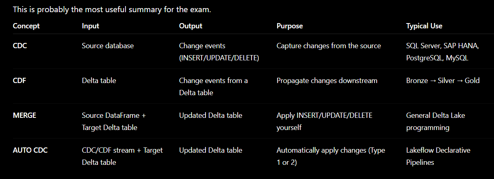

# 4. Production Pipelines

# Productionizing Data Pipelines with Lakeflow

**Lakeflow** is Databricks’ **end-to-end data engineering solution** that unifies the three big parts of production data pipelines: **ingestion, transformation, and orchestration**. [Databricks Documentation](https://docs.databricks.com/aws/en/data-engineering/?utm_source=chatgpt.com)

It includes:

- **Lakeflow Connect** → connectors for ingesting data from apps, databases, cloud storage, message buses, files, etc. [Databricks Documentation](https://docs.databricks.com/aws/en/ingestion/overview?utm_source=chatgpt.com)
- **Lakeflow Spark Declarative Pipelines (SDP)** → declarative batch/streaming pipelines in SQL/Python (the “DLT-style” pipeline framework). [Databricks Documentation+1](https://docs.databricks.com/aws/en/ldp/?utm_source=chatgpt.com)
- **Lakeflow Jobs** → workflow orchestration/scheduling for tasks and pipelines. [Databricks Documentation](https://docs.databricks.com/aws/en/jobs/?utm_source=chatgpt.com)

What Databricks expects you to recognize for “production”:

- **Declarative transformations + automatic orchestration/retries** (you declare *what* each dataset/table should be; Lakeflow runs steps in the right order and retries failures). [Databricks Documentation](https://docs.databricks.com/gcp/en/ldp/concepts)
- **Data quality gates** (expectations/constraints) at the table/flow level. [Databricks Documentation](https://docs.databricks.com/aws/en/ldp/developer/ldp-sql-ref-apply-changes-into)
- **Incremental processing by default** for streaming tables and materialized views (process only new data/changes when possible). [Databricks Documentation+1](https://docs.databricks.com/gcp/en/ldp/concepts)
- **Orchestration & scheduling** with Jobs (DAG of tasks + triggers). [Databricks Documentation](https://docs.databricks.com/aws/en/jobs/)
- **CI/CD deployments** with Asset Bundles (validate → deploy to dev/prod targets → run).

## Lakeflow Spark Declarative Pipelines (what it is + exam-relevant code)

**What it is:** a declarative framework for **batch + streaming** pipelines in SQL/Python, interoperable with Spark DP, 

using a “flows” model. [Databricks Documentation](https://docs.databricks.com/gcp/en/ldp/concepts)

### Python example (Bronze → Silver → Gold)

```python
from pyspark import pipelines as dp

@dp.table
def bronze_orders():
    return (spark.readStream.format("cloudFiles")
            .option("cloudFiles.format", "json")
            .load("/Volumes/main/raw/orders"))

@dp.table
@dp.expect("order_id_not_null", "order_id IS NOT NULL")
@dp.expect("amount_non_negative", "amount >= 0")
def silver_orders():
    return (spark.readStream.table("bronze_orders")
            .dropDuplicates(["order_id"])
            .select("order_id","customer_id","amount","order_ts"))

@dp.table
def gold_daily_revenue():
    return (spark.readStream.table("silver_orders")
            .groupByExpr("date(order_ts) as d")
            .sum("amount"))

```

(Expectations/constraints are a key exam topic.)

### SQL example (same idea)

```sql
CREATE OR REFRESH STREAMING TABLE bronze_orders
AS SELECT * FROM STREAM read_files('/Volumes/main/raw/orders', format => 'json');

CREATE OR REFRESH STREAMING TABLE silver_orders (
  CONSTRAINT order_id_not_null EXPECT (order_id IS NOT NULL),
  CONSTRAINT amount_non_negative EXPECT (amount >= 0)
)
AS SELECT DISTINCT order_id, customer_id, amount, order_ts
FROM STREAM(bronze_orders);

CREATE OR REFRESH LIVE TABLE gold_daily_revenue
AS SELECT date(order_ts) AS d, sum(amount) AS revenue
FROM silver_orders
GROUP BY date(order_ts);

```

[Databricks Documentation+1](https://docs.databricks.com/aws/en/ldp/developer/ldp-sql-ref-apply-changes-into)

## Lakeflow Spark Declarative Pipelines (Hands-ON)

## Change Data Capture (CDC) in Databricks terms

**CDC (Change Data Capture)** is **the pattern of capturing row-level changes in a source system** (typically **INSERT / UPDATE / DELETE**)

 and publishing them as a **change stream (“CDC feed”)**, so downstream pipelines can **apply only the changes** instead of re-reading the full table every run.

 [Databricks Documentation+1](https://docs.databricks.com/aws/en/ldp/what-is-change-data-capture?utm_source=chatgpt.com)

### What a CDC feed usually looks like

Each event typically contains:

- a **primary key** (which row changed),
- an **operation** (I/U/D),
- a **sequence/timestamp** (ordering),
- the **new row values** (and sometimes “before” values). [Databricks Documentation+1](https://docs.databricks.com/aws/en/ldp/what-is-change-data-capture?utm_source=chatgpt.com)

### How this shows up on Databricks (exam-relevant mapping)

- **CDC = concept/pattern** (changes from the *source* DB/app). [Databricks Documentation](https://docs.databricks.com/aws/en/ldp/what-is-change-data-capture?utm_source=chatgpt.com)
- **CDF (Change Data Feed) = Delta’s built-in CDC feed** for Delta tables (row-level changes between table versions). [Databricks Documentation+1](https://docs.databricks.com/aws/en/delta/delta-change-data-feed?utm_source=chatgpt.com)
- **AUTO CDC (Lakeflow Declarative Pipelines)** = the feature that **applies** a CDC/CDF feed into a target table (often as **SCD Type 1 or 2**) without you hand-writing complicated MERGE logic. [Databricks Documentation+2Databricks Documentation+2](https://docs.databricks.com/aws/en/ldp/cdc?utm_source=chatgpt.com)

## Minimal code you should recognize

### 1) Delta Change Data Feed (CDF): enable + read changes

```sql
ALTER TABLE myDeltaTable
SET TBLPROPERTIES (delta.enableChangeDataFeed = true);
```

```python
changes = (spark.readStream
  .option("readChangeFeed", "true")
  .table("myDeltaTable"))
```

[Databricks Documentation](https://docs.databricks.com/aws/en/delta/delta-change-data-feed?utm_source=chatgpt.com)

### 2) Applying a CDC feed with AUTO CDC (DLT/Lakeflow pipelines)

```sql
CREATE OR REFRESH STREAMING TABLE customers_dim;

CREATE FLOW customers_cdc AS
AUTO CDC INTO customers_dim
FROM stream(cdc_data.customers)
KEYS (customer_id)
APPLY AS DELETE WHEN operation = "DELETE"
SEQUENCE BY sequenceNum
COLUMNS * EXCEPT (operation, sequenceNum)
STORED AS SCD TYPE 2;

```

[Databricks Documentation+1](https://docs.databricks.com/aws/en/ldp/developer/ldp-sql-ref-create-flow?utm_source=chatgpt.com)

**Exam gotcha:** if you explicitly define the schema for an **SCD Type 2** target, you must include `__START_AT` and `__END_AT` columns (typed like your `sequence_by`). [Databricks Documentation+1](https://docs.databricks.com/aws/en/ldp/developer/ldp-sql-ref-apply-changes-into?utm_source=chatgpt.com)

### 3) CDC from databases via Lakeflow Connect (why it matters)

Managed connectors can do **incremental ingestion**, and for sources like **SQL Server** they can use **Change Tracking / CDC** to track changes efficiently. [Databricks Documentation+1](https://docs.databricks.com/aws/en/ingestion/lakeflow-connect/?utm_source=chatgpt.com)



## Processing a CDC feed with “DLT” style (AUTO CDC) — brief examples

### SQL: `AUTO CDC INTO` (streaming target + flow)

```sql
CREATE OR REFRESH STREAMING TABLE target;

CREATE FLOW cdc_flow AS AUTO CDC INTO target
FROM stream(cdc_data.users)
KEYS (userId)
APPLY AS DELETE WHEN operation = "DELETE"
SEQUENCE BY sequenceNum
COLUMNS * EXCEPT (operation, sequenceNum)
STORED AS SCD TYPE 2;

```

[Databricks Documentation+1](https://docs.databricks.com/aws/en/ldp/developer/ldp-sql-ref-apply-changes-into)

### Python: `create_auto_cdc_flow()` (replaces older `apply_changes()`)

```python
from pyspark import pipelines as dp

dp.create_streaming_table("target")

dp.create_auto_cdc_flow(
  target="target",
  source="STREAM(cdc_data.users)",
  keys=["userId"],
  sequence_by="sequenceNum",
  apply_as_deletes="operation = 'DELETE'",
  stored_as_scd_type="2"
)

```

Important exam detail: `create_auto_cdc_flow()` **replaces** the older `apply_changes()` name (same signature). [Databricks Documentation](https://docs.databricks.com/aws/en/ldp/developer/ldp-python-ref-apply-changes)

## “Lakeflows” examples (how the pieces fit)

- **Lakeflow Connect**: connectors to ingest from files/apps/databases/message buses; integrates with Unity Catalog + Jobs and supports incremental reads/writes. [Databricks Documentation](https://docs.databricks.com/aws/en/ingestion/overview)
- **Lakeflow Declarative Pipelines**: transformations + quality + AUTO CDC. [Databricks Documentation+1](https://docs.databricks.com/gcp/en/ldp/concepts)
- **Lakeflow Jobs**: orchestrate everything as workflows (tasks + triggers + DAG). [Databricks Documentation](https://docs.databricks.com/aws/en/jobs/)

## Lakeflow Jobs (Hands ON)

**Lakeflow Jobs** is Databricks’ **workflow/orchestration service**: it lets you coordinate and run **multiple tasks** (ETL, pipelines, SQL, etc.) as one **job/workflow**, with scheduling/triggering and production controls. [Databricks Documentation+1](https://docs.databricks.com/aws/en/jobs/)

## Mental model (what a “Lakeflow Job” is)

A **Job = a DAG of tasks + automation + compute + run history**.

### 1) Tasks (the building blocks)

A job has **one or more tasks**, and you define **dependencies** so tasks run **in sequence or parallel**. [Databricks Documentation+1](https://docs.databricks.com/aws/en/jobs/control-flow)

Common task types you’ll see in the exam include: **Notebook, Python script, Python wheel, SQL, Pipeline**, plus control-flow tasks like **If/else** and **For each**. [Databricks Documentation+1](https://docs.databricks.com/aws/en/jobs/configure-task)

### 2) Minimum configuration (exam-friendly)

To run a job you need:

- **Task** (what to run)
- **Compute** (where it runs: serverless, jobs compute, or all-purpose)
- **Schedule/trigger** (optional; can run manually)
- **Name** [Databricks Documentation+1](https://docs.databricks.com/aws/en/jobs/configure-job)

## Automation: schedules & event triggers

Jobs can run:

- **On a time schedule**
- **When tables update**
- **When files arrive** in a **Unity Catalog storage location**
- **Continuously** (always-on workloads)
- Or **manually / via external orchestrators** [Databricks Documentation](https://docs.databricks.com/aws/en/jobs/triggers)

## Production control-flow features you should recognize

### Dependencies + branching

Lakeflow Jobs supports:

- **Task dependencies** (run after X succeeds/fails/etc.)
- **Run if** conditions
- **If/else** branching (can test task values, job parameters, dynamic values)
- **For each** loops (run a task repeatedly with different parameters) [Databricks Documentation](https://docs.databricks.com/aws/en/jobs/control-flow)

### Retries/timeouts (important for reliability)

You can configure **task retries** (useful for transient failures; often recommended with streaming schema evolution scenarios). [Databricks Documentation+1](https://docs.databricks.com/aws/en/jobs/control-flow)

## Compute options (and what to remember)

### Serverless compute for workflows (common modern default)

Serverless lets you run jobs **without managing clusters**; Databricks manages scaling and enables **autoscaling + Photon** automatically. [Databricks Documentation](https://docs.databricks.com/aws/en/jobs/run-serverless-jobs)

It also notes serverless is supported for task types like **notebook, Python script, dbt, Python wheel, JAR** (JAR support may be beta). [Databricks Documentation](https://docs.databricks.com/aws/en/jobs/run-serverless-jobs)

### Continuous mode (for always-on streaming)

Databricks recommends **continuous mode** for always-on streaming workloads, but note:

- **Serverless compute does not support continuous mode**
- Continuous mode has constraints (only one instance, no task dependencies, and different retry behavior). [Databricks Documentation](https://docs.databricks.com/aws/en/jobs/continuous)

## Passing parameters & state between tasks (very testable)

### Dynamic value references

Jobs expose run context variables using `{{ ... }}` (for example `{{job.run_id}}`) that you pass as parameters/arguments into tasks. [Databricks Documentation](https://docs.databricks.com/aws/en/jobs/dynamic-value-references)

### Task Values (task → task communication)

A notebook task can emit values with `dbutils.jobs.taskValues.set(...)`, and a downstream task can read them via a parameter like `{{tasks.<task_key>.values.<key>}}` (commonly used in Asset Bundle job YAML). [Databricks Documentation](https://docs.databricks.com/aws/en/dev-tools/bundles/job-task-types)

**Example (Asset Bundle YAML):**

```yaml
resources:
  jobs:
    demo_job:
      name: demo_job
      tasks:
        - task_key: extract
          notebook_task:
            notebook_path: ../src/extract.ipynb
        - task_key: load
          depends_on:
            - task_key: extract
          notebook_task:
            notebook_path: ../src/load.ipynb
            base_parameters:
              batch_id: "{{tasks.extract.values.batch_id}}"

```

[Databricks Documentation](https://docs.databricks.com/aws/en/dev-tools/bundles/job-task-types)

**In `extract.ipynb`:**

```python
dbutils.jobs.taskValues.set(key="batch_id", value="2025-12-14")

```

[Databricks Documentation](https://docs.databricks.com/aws/en/dev-tools/bundles/job-task-types)

## Monitoring & observability

- The UI shows **job runs history and run details**. [Databricks Documentation](https://docs.databricks.com/gcp/en/jobs/monitor)
- You can query account-level job activity via **system tables in `system.lakeflow`** (and Databricks notes this schema was previously called `workflow`). [Databricks Documentation+1](https://docs.databricks.com/gcp/en/jobs/monitor)

## “Productionizing” / CI-CD hooks

- You can create/manage jobs via **UI, CLI, or REST API**, and Databricks points to **Asset Bundles** for IaC-style deployment. [Databricks Documentation+1](https://docs.databricks.com/aws/en/jobs/configure-job)
- In the UI you can **switch to a YAML “code version”** view of a job (handy for exam + real deployments). [Databricks Documentation](https://docs.databricks.com/aws/en/jobs/configure-job)

## Deploying Jobs with Databricks Asset Bundles

Asset Bundles let you **validate, deploy, and run** Jobs/Pipelines programmatically (CI/CD). [Databricks Documentation+2Databricks Documentation+2](https://docs.databricks.com/aws/en/dev-tools/bundles/jobs-tutorial)

### Core CLI flow (what to remember)

```bash
databricks bundle init
databricks bundle validate
databricks bundle deploy --target dev
databricks bundle run --target dev sample_job

```

[Databricks Documentation](https://docs.databricks.com/aws/en/dev-tools/bundles/jobs-tutorial)

### What’s inside a bundle (high level)

- `databricks.yml` defines bundle name + workspace targets (dev/prod) and supports “modes”/presets for CI/CD style behavior. [Databricks Documentation+1](https://docs.databricks.com/aws/en/dev-tools/bundles/jobs-tutorial)
- `resources/*.yml` defines your **job** and/or **pipeline** resources. [Databricks Documentation+1](https://docs.databricks.com/aws/en/dev-tools/bundles/jobs-tutorial)

If you want, I can turn this into a **1-page exam cheat sheet** + **10 multiple-choice questions** focused on Lakeflow Pipelines/Jobs + CDC/CDF + Asset Bundles.

**Databricks Asset Bundles (DABs)** are **a “project-as-code” packaging format**: you keep your **code (notebooks/scripts/wheels)** *plus* **YAML that declares the Databricks resources** (Jobs, Lakeflow Declarative Pipelines, etc.) in a repo, then use the **Databricks CLI** to **validate → deploy → run** that project in a workspace. [Databricks Documentation+2Databricks Documentation+2](https://docs.databricks.com/aws/en/dev-tools/bundles/)

### Why they exist (plain English)

They’re the Databricks-native way to do **CI/CD for data projects**: same repo can be deployed to **dev / staging / prod** using **deployment targets**, with consistent job/pipeline definitions. [Databricks Documentation+1](https://docs.databricks.com/aws/en/dev-tools/bundles/work-tasks)

### What’s inside a bundle

At minimum you have **one file**: `databricks.yml` (required). It typically contains:

- `bundle:` metadata (name)
- `targets:` environments (dev/prod)
- `resources:` definitions (jobs, pipelines, etc.) [Databricks Documentation+2Databricks Documentation+2](https://docs.databricks.com/aws/en/dev-tools/bundles/work-tasks)

You can also use **substitutions/variables** to avoid hardcoding paths/values. [Databricks Documentation](https://docs.databricks.com/aws/en/dev-tools/bundles/variables)

### How you use it (the lifecycle)

- `databricks bundle init` (scaffold)
- `databricks bundle validate`
- `databricks bundle deploy --target dev`
- `databricks bundle run --target dev <job_name>` [Databricks Documentation+2Databricks Documentation+2](https://docs.databricks.com/aws/en/dev-tools/bundles/)

### Minimal example (`databricks.yml`)

This defines a **Job** as a resource (exact style you’ll see in docs/exam prep): [Databricks Documentation+1](https://docs.databricks.com/aws/en/dev-tools/bundles/resources)

```yaml
bundle:
  name: hello-bundle

workspace:
  root_path: /Workspace/Users/${workspace.current_user.userName}/.bundle/${bundle.name}/${bundle.target}

targets:
  dev:
    mode: development

resources:
  jobs:
    hello_world:
      name: hello_world
      tasks:
        - task_key: task
          spark_python_task:
            python_file: ../src/main.py
          environment_key: default
      environments:
        - environment_key: default
          spec:
            environment_version: "2"
```

### Quick “don’t confuse with Terraform”

Databricks’ own guidance is: **Bundles = deploy workspace assets (jobs/pipelines/code)**, while **Terraform = provision infrastructure (workspaces, principals, cloud resources, etc.)**. [databricks.com](https://www.databricks.com/blog/announcing-public-preview-databricks-asset-bundles-apply-software-development-best-practices?utm_source=chatgpt.com)

If you want, paste your current repo structure (or what you’re trying to deploy: job vs pipeline), and I’ll show the **exact bundle layout + YAML** you’d use.

### **CI/CD** stands for:

- **CI = Continuous Integration**: developers regularly merge code into a shared repo, and **automated checks** run (tests, linting, building artifacts) to catch issues early.
- **CD = Continuous Delivery/Deployment**: after CI passes, you **automatically deliver** the validated code/config to an environment (dev/staging/prod).
    - **Delivery**: it’s ready to deploy (often with a manual approval step).
    - **Deployment**: it deploys automatically to production.

**In Databricks terms:** CI/CD often means your repo contains notebooks/code + **Databricks Asset Bundles YAML**, and a pipeline (GitHub Actions/Azure DevOps, etc.) runs `bundle validate` then `bundle deploy` to dev/prod.

### **NOTE: DABs Renaming**

**Databricks Asset Bundles are now called Declarative Automation Bundles**

Databricks is officially evolving the name from Databricks Asset Bundles to Declarative Automation Bundles to better reflect what it actually does: automate deployments.

This is a non-breaking change. The `bundle` CLI command, the acronym (DABs), and all of your existing configurations remain exactly the same. You do not need to change a single line of code.

**Why the change?**

This shift is made for two main reasons:

- Semantic Meaning: DABs are built for repeatable, automatable deployments. The name "Declarative Automation Bundles" better reflects this vision.
- Clearing up Confusion: “Assets” is often mistaken for static data files rather than the automated workflows they actually represent.

So, it's a just small update on what the "D" and "A" stand for.

- **DABs Important Commands**
    
    #### bundle generate
    
    Instead of manually copying the definition of a job or any other resource from your Databricks workspace, the **databricks bundle generate** command automatically creates a bundle configuration for an existing workspace resource.
    
    `databricks bundle generate job --existing-job-id <job_id>`
    
    This command generates a YAML definition for a job (or other supported resources such as pipelines, apps, or dashboards) and automatically downloads its referenced artifacts, such as notebooks.
    
    **Flags:**
    
    - **-existing-job-id int**: Specifies the job ID of the existing job to generate the configuration for.
    - **-bind**: Automatically links the generated resource to the existing workspace resource, so subsequent bundle deployments update the existing resource instead of creating a new one.
    
    #### bundle deploy
    
    The `databricks bundle deploy` command comes with several important flags:
    
    **1. auto-approve**
    
    `databricks bundle deploy -t prod --auto-approve`
    
    The bundle deploy command accepts the **--auto-approve** flag to handle automated, non-interactive environments by skipping interactive approvals that might be required for deployment.
    
    When executing deployments inside automated CI/CD tools (like GitHub Actions, GitLab CI/CD, or Azure DevOps), there is no terminal interface for a human to type "yes" or confirm the execution. Appending the --auto-approve flag tells the Databricks CLI to skip any interactive prompt confirmations and directly execute the resource updates.
    
    **2. fail-on-active-runs**
    
    `databricks bundle deploy --target prod --fail-on-active-runs`
    
    The --fail-on-active-runs flag explicitly instructs the deployment engine to fail and stop the deployment if there are any active, ongoing runs for the jobs or pipelines defined within that bundle.
    
    This is a critical best practice when pushing to a production target (-t prod) because it prevents the deployment from corrupting active operational workloads—such as abruptly deleting and recreating the source code while an active task is in the middle of spinning up and trying to read it.
    
    #### Authentication using Personal Access Token
    
    In addition to OAuth, you can also configure workspace authentication using a Personal Access Token (PAT), which is a secure string (like a password) that you can generate from the [workspace settings](https://docs.databricks.com/aws/en/dev-tools/auth/pat#create-personal-access-tokens-for-workspace-users). To configure authentication for a bundle project, you just need to set the following two environment variables in your local shell:
    
    - **DATABRICKS_HOST:** the URL of your Databricks workspace (e.g., https://your-workspace.cloud.databricks.com)
    - **DATABRICKS_TOKEN:** your personal access token.
    
    This enables the Databricks CLI to automatically detect and authenticate your deployment session against the targeted development workspace.
    
    IMPORTANT: Where possible, Databricks recommends using OAuth instead of PATs for authentication because OAuth provides stronger security. However, for your certification exam, it is important to recognize both authentication methods.
