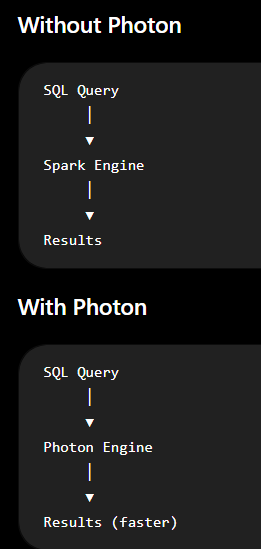
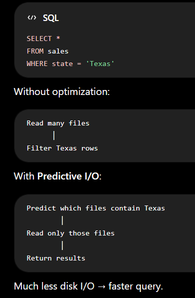
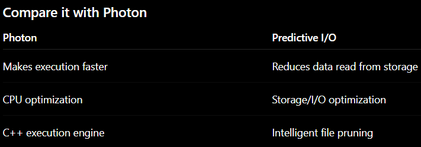
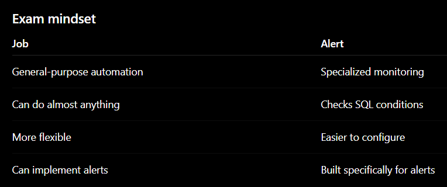
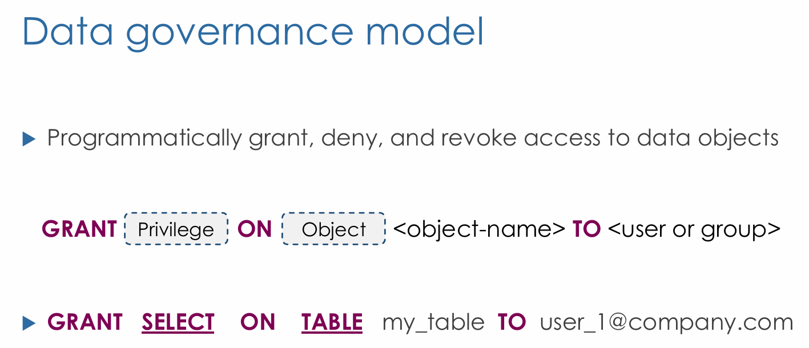
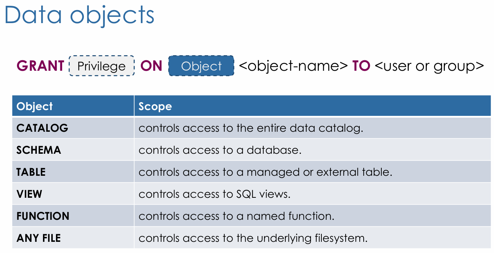
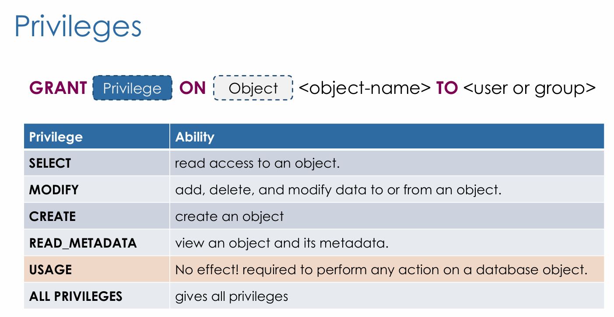
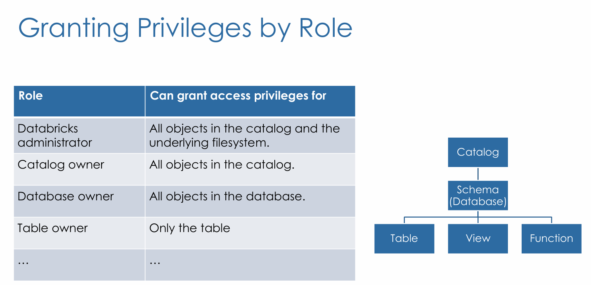
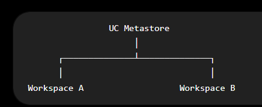

# 5. Data Governance

# Data Governance and Quality

## Databricks SQL

### What Databricks SQL is

**Databricks SQL** is the **SQL-first** part of Databricks for **interactive querying + serving analytics**: you run SQL in a dedicated UI/API, on **SQL warehouses**, and you can package results into **dashboards** and **alerts**.

Think “**warehouse & BI serving layer** on the lakehouse,” not “ETL notebooks.”

### Why it’s different (and important)

**Different from notebooks/engineering clusters**

- In Databricks SQL, queries run on a **SQL warehouse** (a compute resource designed for SQL concurrency/serving). [Databricks Documentation+1](https://docs.databricks.com/aws/en/compute/sql-warehouse/?utm_source=chatgpt.com)
- You *can* attach notebooks to a SQL warehouse, but Databricks calls out there are **limitations** (so: “SQL warehouse ≠ general-purpose cluster”). [Databricks Documentation](https://docs.databricks.com/aws/en/sql/get-started/concepts)

**Why data engineers care?**

Databricks SQL is how teams typically:

- **Serve Power BI / Tableau-style workloads** (ODBC/JDBC, partner connectors). [Databricks Documentation+1](https://docs.databricks.com/aws/en/integrations/jdbc-odbc-bi?utm_source=chatgpt.com)
- Provide **governed, consistent access** to curated tables/views in Unity Catalog. [Databricks Documentation+2Databricks Documentation+2](https://docs.databricks.com/aws/en/data-governance/unity-catalog/access-control?utm_source=chatgpt.com)
- Add **monitoring via query history + alerts** for operational visibility. [Databricks Documentation+2Databricks Documentation+2](https://docs.databricks.com/aws/en/sql/user/queries/query-history?utm_source=chatgpt.com)

### Core concepts you should know cold

**1) SQL Warehouses (compute)**

A **SQL warehouse** is the compute that executes Databricks SQL queries. [Databricks Documentation+1](https://docs.databricks.com/aws/en/compute/sql-warehouse/?utm_source=chatgpt.com)

**Warehouse types (exam-friendly):**

- **Serverless, Pro, Classic** [Databricks Documentation](https://docs.databricks.com/aws/en/compute/sql-warehouse/warehouse-types)
- Performance capabilities differ (e.g., **Photon**, **Predictive IO**, and serverless-only **Intelligent Workload Management**). [Databricks Documentation+1](https://docs.databricks.com/aws/en/compute/sql-warehouse/warehouse-types)
    - **Photon**: Photon is Databricks' high-performance execution engine for Spark SQL and DataFrame operations.
        
        
        
        Why is it faster?
        
        Spark is largely written in **Java/Scala**.
        
        Photon is written in **C++**, which is highly optimized for:
        
        - Modern CPUs
        - Vectorized execution (processing many values at once)
        - Efficient memory usage
        
        As a result, many SQL and DataFrame operations run significantly faster.
        
        Does it slow down pure Python? —> Practically, no.
        
        The only tiny overhead is that you're running inside a Spark environment, but that's true whether Photon is enabled or not. Photon itself doesn't make your Python loops slower.
        
    - Predictive I/O: Is another automatic Databricks optimization. It predicts which data files will be needed and skips reading the ones that are irrelevant.
        
        Think of a Delta table with 10,000 Parquet files.
        
        You run:
        
        
        
        **How does it know?**
        
        Databricks uses metadata and statistics collected about the files, such as:
        
        - Min/max values
        - Column statistics
        - File layout
        - Query history (hence the name "Predictive")
        
        It intelligently prunes files before reading them.
        
        
        
        **Predictive I/O cannot sacrifice correctness for speed.**
        
        Databricks guarantees the query returns the **same result**.
        
- Databricks documentation repeatedly **recommends serverless when available**. [Databricks Documentation+2Databricks Documentation+2](https://docs.databricks.com/aws/en/compute/sql-warehouse/create?utm_source=chatgpt.com)

Also know the idea of **sizing/scaling/queuing behavior** (how warehouses handle concurrency and cost). [Databricks Documentation](https://docs.databricks.com/aws/en/compute/sql-warehouse/warehouse-behavior?utm_source=chatgpt.com)

- **Intelligent Workload Management (IWM):** is a feature of the Serverless SQL Warehouse, not the warehouse itself. It automatically manages the execution of multiple concurrent SQL queries.
    - **Serverless SQL Warehouse** = the compute.
    - **Intelligent Workload Management** = an optimization feature inside the Serverless SQL Warehouse that automatically manages concurrency, scheduling, and resource allocation for SQL queries.
    

**2) SQL assets: Queries, Dashboards, Alerts**

Databricks SQL organizes work around these assets: **queries, dashboards, alerts, query history**. [Databricks Documentation+1](https://docs.databricks.com/aws/en/sql/get-started/concepts)

**Dashboards (AI/BI dashboards):**

- Dashboards are built from **datasets/queries + visualizations + filters**. [Databricks Documentation+1](https://docs.databricks.com/aws/en/dashboards/)
- Big security gotcha: **dashboard viewers can access all data returned by the dataset query**, even if not all fields appear in a chart—so you must scope the dataset query carefully. [Databricks Documentation](https://docs.databricks.com/aws/en/dashboards/)
- Dataset queries used for dashboards are **read-only** (not DDL/DML). [Azure Docs](https://docs.azure.cn/en-us/databricks/dashboards/datasets?utm_source=chatgpt.com)

**Alerts:**

An alert **runs a query on a schedule**, checks a condition, and **notifies** if it’s met (and it runs independently of any schedule on the underlying query). [Databricks Documentation+1](https://docs.databricks.com/aws/en/sql/user/alerts/)

**Difference between a Job and an Alert:**

An Alert is essentially a specialized Job with a built-in notification mechanism. 

Then why have Alerts? —>  Because they are much simpler.



**3) Governance with Unity Catalog (UC)**

For the exam, assume a “modern” Databricks setup:

- **SQL warehouses always comply with Unity Catalog requirements**, while some cluster access modes might not. [Databricks Documentation+1](https://docs.databricks.com/aws/en/data-governance/unity-catalog/get-started)
- You manage access through **UC privileges** (GRANT/REVOKE on catalogs/schemas/tables/views, etc.). [Databricks Documentation+2Databricks Documentation+2](https://docs.databricks.com/aws/en/data-governance/unity-catalog/manage-privileges/?utm_source=chatgpt.com)

**4) Observability: Query history**

- The **Query history UI** shows statement text + duration + rows + I/O/performance details. [Databricks Documentation](https://docs.databricks.com/aws/en/sql/user/queries/query-history?utm_source=chatgpt.com)
- There’s also a **system table** for query history; it includes queries run on **SQL warehouses** and also **serverless compute for notebooks and jobs**. [Databricks Documentation](https://docs.databricks.com/aws/en/admin/system-tables/query-history?utm_source=chatgpt.com)

**5) Federation (Lakehouse Federation)**

Databricks SQL can run **federated queries** against external systems **without migrating the data**, using **Lakehouse Federation** (Unity Catalog only). [Databricks Documentation+1](https://docs.databricks.com/aws/en/query-federation/?utm_source=chatgpt.com)

### SQL skills that tend to be “testable”

You should be comfortable recognizing/using Databricks SQL as a **standard SQL surface** (Databricks maintains a SQL language reference). [Databricks Documentation](https://docs.databricks.com/aws/en/sql/language-manual/?utm_source=chatgpt.com)

Typical DE patterns you’ll see:

- **CTAS** / creating curated tables from raw
- **VIEWs** for abstraction
- **MERGE** for incremental upserts
- **GRANT/REVOKE** for governed access (UC)

(If you want, I’ll give you a tight “top 20 commands” list aligned to DE workflows.)

### Quick mental checklist (if you see an exam question)

1. “What compute runs it?” → **SQL warehouse**; know serverless/pro/classic differences. [Databricks Documentation+1](https://docs.databricks.com/aws/en/compute/sql-warehouse/warehouse-types)
2. “Who can see what?” → **Unity Catalog privileges**, and dashboard dataset scoping risk. [Databricks Documentation+1](https://docs.databricks.com/aws/en/data-governance/unity-catalog/access-control?utm_source=chatgpt.com)
3. “How do we monitor?” → **Query history + alerts**. [Databricks Documentation+1](https://docs.databricks.com/aws/en/sql/user/queries/query-history?utm_source=chatgpt.com)
4. “Do we need external DB access?” → consider **Lakehouse Federation**. [Databricks Documentation+1](https://docs.databricks.com/aws/en/query-federation/?utm_source=chatgpt.com)

### Most Used SQL queries:

- `USE CATALOG` — pick catalog
- `USE SCHEMA` — pick schema
- `SHOW TABLES` — list tables
- `DESCRIBE TABLE` — inspect columns
- `SHOW CREATE TABLE` — see the DDL
- `CREATE SCHEMA` — create schema
- `DROP SCHEMA` — remove schema
- `CREATE TABLE` — create table
- `CREATE TABLE … LOCATION` — external table path
- `CREATE TABLE AS SELECT` (CTAS) — create+load
- `CREATE OR REPLACE VIEW` — publish logic
- `CREATE OR REPLACE TEMP VIEW` — staging logic
- `ALTER TABLE … ADD COLUMNS` — evolve schema
- `ALTER TABLE … ALTER COLUMN` — change type/comment/nullability (where supported)
- `ALTER TABLE … RENAME COLUMN`
- `ALTER TABLE … DROP COLUMN`
- `ALTER TABLE … RENAME TO`
- `ALTER TABLE … SET TBLPROPERTIES` — set properties
- `COPY INTO` — ingest files into table
- `INSERT INTO` — append rows
- `INSERT OVERWRITE` — replace target (careful)
- `MERGE INTO` — upsert (incremental loads)
- `UPDATE` — targeted fixes
- `DELETE` — targeted removals
- `DROP TABLE` — remove table
- `OPTIMIZE` — compact files
- `OPTIMIZE … ZORDER BY` — improve data skipping
- `VACUUM` — delete old files (retention rules apply)
- `RESTORE TABLE` — time travel rollback
- `DESCRIBE DETAIL` — Delta metadata
- `DESCRIBE HISTORY` — Delta audit trail
- `EXPLAIN` — view query plan
- `ANALYZE TABLE COMPUTE STATISTICS` — stats for optimizer
- `REFRESH TABLE` — refresh metadata/cache
- `SELECT` — core transform
- `WITH` — CTEs
- `JOIN` — combine datasets
- `CREATE STREAMING TABLE` **(DLT)** — define streaming target
- `CONSTRAINT … EXPECT` **(DLT)** — data quality rules
- `LEFT SEMI JOIN` — keep matching left rows only
- `LEFT ANTI JOIN` — keep non-matching left rows
- `UNION ALL` — stack datasets
- `GROUP BY` — aggregation
- `HAVING` — filter aggregates
- `… OVER (PARTITION BY … ORDER BY …)` — window functions
- `LATERAL VIEW EXPLODE` — flatten arrays/maps
- `GRANT` — permissions
- `REVOKE` — remove permissions
- `CREATE LIVE TABLE` **(DLT)** — batch/live table in DLT
- `APPLY CHANGES INTO` **(DLT)** — CDC-style upserts in DLT

## Data Objects Privileges

in Databricks, **data governance** (access control) is basically: **who (principal) can do what (privilege) on which data object (securable object)**. You’ll usually manage this through the metastore security layer (often Unity Catalog), but I’ll focus on the *privileges + objects*, not the UC setup. [Databricks Documentation+1](https://docs.databricks.com/aws/en/data-governance/unity-catalog/manage-privileges/privileges)

### Data objects you grant privileges on

Common “securable objects” include: **metastore, catalog, schema, table, view, materialized view, volume, function/model**, plus storage/federation objects like **external location, storage credential, connection**, and sharing objects like **share/recipient/provider**. [Databricks Documentation+1](https://docs.databricks.com/aws/en/data-governance/unity-catalog/manage-privileges/privileges)

### The privilege categories that matter in DE workflows

**1) Discover vs Use vs Read**

- **BROWSE** → lets users *see metadata* (Catalog Explorer/search/lineage/info schema) without necessarily having `USE CATALOG/USE SCHEMA`. Useful for “discover + request access” patterns. [Databricks Documentation](https://docs.databricks.com/aws/en/data-governance/unity-catalog/manage-privileges/privileges)
- **USE CATALOG / USE SCHEMA** → lets a user *navigate and interact* inside a catalog/schema, but **does not grant data access by itself**. [Databricks Documentation](https://docs.databricks.com/aws/en/data-governance/unity-catalog/manage-privileges/privileges)
- **SELECT** → actual ability to query a table/view (still requires `USE CATALOG` + `USE SCHEMA` on parents). [Databricks Documentation](https://docs.databricks.com/aws/en/data-governance/unity-catalog/manage-privileges/privileges)

**Rule of thumb:** to query a table you typically need **USE CATALOG + USE SCHEMA + SELECT**. [Databricks Documentation](https://docs.databricks.com/aws/en/data-governance/unity-catalog/manage-privileges/privileges)

**2) Write data vs Create objects**

- **MODIFY** → allows changing table data (INSERT/UPDATE/DELETE/MERGE), and Databricks notes it’s intended for add/update/delete, but it’s still gated by other required privileges (like SELECT + USE*). [Databricks Documentation+1](https://docs.databricks.com/aws/en/data-governance/unity-catalog/manage-privileges/privileges)
- **CREATE TABLE / CREATE SCHEMA / CREATE FUNCTION / CREATE VOLUME** → allows creating those objects in the parent container (schema/catalog) and typically requires `USE CATALOG/USE SCHEMA` too. [Databricks Documentation](https://docs.databricks.com/aws/en/data-governance/unity-catalog/manage-privileges/privileges)

**3) Steward/admin controls**

- **MANAGE** (or ownership) → can manage privileges / transfer ownership / drop / rename (depending on model). [Databricks Documentation+1](https://docs.databricks.com/aws/en/data-governance/unity-catalog/manage-privileges/privileges)
- **APPLY TAG** → can add/edit tags (including column tagging when granted on tables/views). [Databricks Documentation+1](https://docs.databricks.com/aws/en/data-governance/unity-catalog/manage-privileges/privileges)

### Data Governance Model









### Practical “recipes” (what you grant to whom)

**A) BI readers (Gold only)**

```sql
GRANT USE CATALOG ON CATALOG prodTO `bi_readers`;
GRANT USE SCHEMA ON SCHEMA  prod.goldTO `bi_readers`;
GRANT SELECT ON TABLE   prod.gold.salesTO `bi_readers`;
```

(That “USE + SELECT” pattern is explicitly called out in the privilege definitions.) [Databricks Documentation](https://docs.databricks.com/aws/en/data-governance/unity-catalog/manage-privileges/privileges)

**B) ETL pipeline writer (Bronze/Silver)**

- Needs **CREATE TABLE** (schema), and **MODIFY** (tables) for upserts/backfills. [Databricks Documentation](https://docs.databricks.com/aws/en/data-governance/unity-catalog/manage-privileges/privileges)

**C) Data steward**

- Needs **BROWSE** broadly + **APPLY TAG** + possibly **MANAGE** on governed areas. [Databricks Documentation+1](https://docs.databricks.com/aws/en/data-governance/unity-catalog/manage-privileges/privileges)

### Data quality (how it connects)

For quality in DE pipelines, Databricks supports **pipeline expectations** (Lakeflow/Declarative Pipelines): they’re **record-level checks** that can **track metrics** and optionally **drop bad rows or fail the update**. [Databricks Documentation+1](https://docs.databricks.com/aws/en/ldp/expectations)

## Managing Permissions (Hands On)

## Unity Catalog

## 1. What is Unity Catalog?

> **Unity Catalog is Databricks' centralized governance layer for data and AI assets.**
> 

It provides:

- Centralized permissions
- Metadata management
- Data lineage
- Data discovery
- Auditing
- Cross-workspace governance

One Unity Catalog metastore can govern **multiple Databricks workspaces**.

## 2. UC Architecture



Without Unity Catalog:

- Every workspace had its own Hive Metastore.

With Unity Catalog:

- One Metastore
- One permission model
- One governance model

**Exam takeaway**

> Unity Catalog centralizes governance across workspaces.
> 

## 3. UC Hierarchy ⭐⭐⭐

```
Metastore
    │
Catalog
    │
Schema (Database)
    │
├── Tables
├── Views
├── Functions
└── Volumes
```

Remember:

- Metastore owns Catalogs.
- Catalogs own Schemas.
- Schemas own Tables, Views, Functions, and Volumes.

## 4. 3-Level Namespace ⭐⭐⭐

Legacy:

```
schema.table
```

Unity Catalog:

```
catalog.schema.table
```

Example:

```
SELECT*FROM sales.finance.orders;
```

where

```
sales
   ↑ Catalog

finance
   ↑ Schema

orders
   ↑ Table
```

---

## 5. Structured vs Unstructured Data

Schemas can contain both:

## Structured

- Tables
- Views

## Unstructured

- Volumes

Volumes store:

- JSON
- CSV
- Images
- PDFs
- Excel
- ML models

Tables store structured (usually Delta) data.

---

## 6. Other UC Objects

Besides Catalogs and Schemas, Unity Catalog also manages:

- Storage Credentials
- External Locations
- Shares
- Recipients

These are securable objects too.

---

## 7. Principals

Permissions are granted to **Principals**.

A principal is:

- User
- Group
- Service Principal

Examples:

```
Carlos
Finance Team
ETL Service Account
```

Users are identified by email addresses, service principals by application IDs, and groups can contain users and service principals.

---

## 8. Identity Federation

One Databricks Account manages identities.

```
Account
     │
 ├── Workspace A
 └── Workspace B
```

The same user exists across every workspace.

No duplicate user management.

---

## 9. Privileges ⭐⭐⭐

Common privileges:

```
SELECT
MODIFY
CREATE
EXECUTE
READ FILES
WRITE FILES
USE CATALOG
USE SCHEMA
BROWSE
MANAGE
```

Basic meanings:

| Privilege | Purpose |
| --- | --- |
| SELECT | Read table data |
| MODIFY | Insert/Update/Delete |
| CREATE | Create new objects |
| EXECUTE | Run functions |
| READ FILES | Read files in volumes |
| WRITE FILES | Write files to volumes |
| USE CATALOG | Enter a catalog |
| USE SCHEMA | Enter a schema |
| BROWSE | Discover metadata |
| MANAGE | Administer object permissions |

---

## 10. Securable Objects

Privileges apply to securable objects.

Examples:

```
Catalog
Schema
Table
View
Function
Volume
Storage Credential
External Location
Share
Recipient
```

General syntax:

```
GRANT<Privilege>ON<Object>TO<Principal>;
```

Example:

```
GRANTSELECTONTABLE sales.finance.ordersTO analysts;
```

---

## 11. USE vs SELECT ⭐⭐⭐⭐⭐

This is one of the biggest exam topics.

To read a table:

```
Catalog
    │
Schema
    │
Table
```

Need:

```
USE CATALOG
      +
USE SCHEMA
      +
SELECT
```

Memory trick:

```
Catalog → USE CATALOG

Schema → USE SCHEMA

Table → SELECT
```

---

## 12. BROWSE ⭐⭐⭐

BROWSE ≠ SELECT

BROWSE lets users:

- Discover data
- Search Catalog Explorer
- View metadata
- View lineage

It **does not** let them query data.

Think:

```
BROWSE

"I know the table exists."
```

vs

```
SELECT

"I can read the rows."
```

---

## 13. MANAGE ⭐⭐⭐

MANAGE is administrative.

It does **NOT** automatically grant:

- SELECT
- MODIFY

Instead it allows:

- Manage permissions
- Manage ownership
- Administer the object

Think:

```
MANAGE

"I manage the table."

NOT

"I can query the table."
```

---

## 14. Data Steward (Typical Role)

Typical permissions:

```
BROWSE
APPLY TAG
MANAGE
```

Responsibilities:

- Discover data
- Classify data
- Apply governance tags
- Help administer permissions

Not necessarily:

- Querying data
- Building pipelines

---

## 15. SQL Warehouse & Unity Catalog ⭐⭐⭐

SQL Warehouses are always UC-compliant.

Meaning:

Every SQL query goes through Unity Catalog security.

Clusters:

Only certain access modes support Unity Catalog.

---

## 16. Legacy Hive Metastore

Old Databricks:

```
Workspace
    │
Hive Metastore
```

Modern Databricks:

```
UC Metastore
    │
Catalogs
```

Legacy Hive Metastore can still coexist while migrating to Unity Catalog.

---

## 17. Why Unity Catalog Exists (Exam Summary)

Unity Catalog provides:

- Centralized governance
- Cross-workspace permissions
- Data discovery
- Data lineage
- Audit logging
- Metadata management
- SQL-based security
- Governance for tables, files, ML models, dashboards, and more

---

## ⭐ Final Memory Sheet (5-minute Review)

```
UC = Governance

Hierarchy

Metastore
   │
Catalog
   │
Schema
   │
Table/View/Function/Volume
```

```
Namespace

catalog.schema.table
```

```
Read Table

USE CATALOG
      +
USE SCHEMA
      +
SELECT
```

```
BROWSE

Discover metadata
NOT data
```

```
MANAGE

Administer permissions
NOT read data
```

```
Principals

Users
Groups
Service Principals
```

```
Volumes

Files

Tables

Structured Data
```

## **Unity Catalog Advanced Topics**

### Converting External Tables to Managed Tables

In Unity Catalog, you can easily convert an existing external Delta table into a managed table using the command:

`ALTER TABLE <table_name> SET MANAGED`

This command copies the table directory from its original location to the default location managed by Unity Catalog. The original location is not immediately removed when the command is run. The data is safely retained for 14 days, allowing rollback during this period.

Although you can also use CREATE TABLE AS SELECT (CTAS) for conversion, Databricks recommends `SET MANAGED` for the following benefits:

- Retains table history (allowing for continuous time travel)
- Keeps the same table configurations, including table name, Unity Catalog permissions, tags, properties, and associated views.
- Supports rolling back a converted managed table to an external table within 14 days using `UNSET MANAGED`.
- Minimizes reader and writer downtime.
- Handles concurrent writes during conversion
- Redirects path-based reads and writes to allow legacy code to function after conversion, for example:
    
    `SELECT * FROM delta.`/path/to/external_table``
    

### Streaming behavior:

To prevent streaming data corruption or missing updates during this migration, Databricks intentionally interrupts active streams reading from or writing to the table. You may see the error message **DELTA_STREAMING_INTERRUPTED_BY_MANAGED_TABLE_CONVERSION**. This is built-in safety feedback telling you that the structure has changed. To fix it, you simply need to restart the streaming job. Once restarted with the same configuration, it will leverage Unity Catalog's automatic redirection and pick up right where it left off using the newly managed table.

### Predictive Optimization

Predictive Optimization is an AI-driven feature that automatically handles maintenance operations for Unity Catalog managed tables, eliminating the need for manual tuning, improving query performance, and reducing storage costs.

Predictive optimization runs the following operations automatically for enabled tables:

- `OPTIMIZE`to triggers incremental clustering for enabled tables. If automatic liquid clustering is enabled, predictive optimization might select new clustering keys before clustering data.
- `VACUUM` to reduces storage costs by deleting data files no longer referenced by the table.
- `ANALYZE`: to triggers incremental update of table statistics. These statistics are used by the query optimizer to generate an optimal query plan. See [ANALYZE TABLE](https://docs.databricks.com/aws/en/sql/language-manual/sql-ref-syntax-aux-analyze-table).
- OPTIMIZE does not run ZORDER when executed with predictive optimization.

**Enable Predictive Optimization**

Predictive optimization is enabled by default for new accounts. To manually enable or disable predictive optimization for an account, navigate to Feature Enablement in your accounts console.

You can also enable or disable predictive optimization for a catalog, or a schema using:

`ALTER CATALOG <catalog_name> { ENABLE | DISABLE } PREDICTIVE OPTIMIZATION;`

`ALTER SCHEMA <schema_name> { ENABLE | DISABLE } PREDICTIVE OPTIMIZATION;`

Databricks recommends enabling predictive optimization for all Unity Catalog managed tables to simplify data maintenance and reduce storage costs.

## Unity Catalog (Hands On)

## Delta Sharing

Delta Sharing is Databricks' secure way of sharing data with other organizations or platforms without copying the data. Think of it as **"read-only sharing"**.

### Without Delta Sharing

Company A wants to share data with Company B.

```
Company A
     │
Copy files
     │
     ▼
Company B
```

Problems:

- Duplicate data
- Synchronization issues
- Extra storage

---

### With Delta Sharing

```
Company A
      │
Delta Sharing
      │
      ▼
Company B
```

Company B reads **your** Delta tables.

No copy required.

---

### Who can receive the data?

Almost anyone.

Examples:

- Another Databricks workspace
- Power BI
- Tableau
- Pandas
- Spark
- Python

Even if they don't use Databricks.

---

### Unity Catalog objects

Remember the hierarchy?

```
Metastore
    │
Share
    │
Recipient
```

These are the two new objects.

### Share

A Share contains:

- Tables
- Views

that you want to expose.

Example:

```
Share
├── sales.orders
├── sales.customers
└── sales.products
```

---

### Recipient

The Recipient is:

> **Who receives the shared data.**
> 

Could be:

- Another company
- Another Databricks account
- A customer

---

### Workflow

```
Create Table
      │
      ▼
Create Share
      │
Add Tables
      │
Create Recipient
      │
Grant Recipient access
```

---

### Permissions

Only the data you explicitly place into a **Share** becomes visible.

Everything else remains private.

### Exam questions

Typical questions are:

> How do I share a Delta table without copying it?
> 

Answer:

> **Delta Sharing**
> 

> What Unity Catalog objects are used?
> 

Answer:

- Share
- Recipient

## Mental model

```
Table
   │
   ▼
Share
   │
   ▼
Recipient
```

### One sentence for the exam ⭐⭐⭐

> **Delta Sharing is an open protocol that securely shares live Delta tables with other users, organizations, or platforms without copying the underlying data.**
> 

### One connection

Notice how Unity Catalog has gradually grown:

```
Metastore
    │
Catalog
    │
Schema
    │
Tables
Views
Functions
Volumes
Shares
Recipients
```

Everything—including **Delta Sharing**—is governed by Unity Catalog. That's why Delta Sharing is typically taught immediately after the Unity Catalog section.

### Code Example:

#### Step 1. Create a Share

```
CREATE SHARE sales_share;
```

Think of this as creating a folder called **sales_share**.

#### Step 2. Add a table to the Share

```
ALTER SHARE sales_shareADDTABLE sales.finance.orders;
```

Now the share contains:

```
sales_share
    │
    └── sales.finance.orders
```

---

#### Step 3. Create a Recipient

```
CREATE RECIPIENT customer_A;
```

The recipient is the external company.

---

#### Step 4. Grant the Share

```
GRANTSELECTON SHARE sales_shareTO RECIPIENT customer_A;
```

Now:

```
Our Company
      │
orders table
      │
      ▼
sales_share
      │
      ▼
customer_A
```

The customer can read the table.

---

### What does the customer do?

The customer doesn't access your catalog directly.

They receive the Share and can query it like a normal table in their environment.

For example:

```
SELECT*FROM shared_orders;
```

Notice they are **not** querying:

```
sales.finance.orders
```

They only see the shared version.

---

### Exam mental model

```
Unity Catalog
      │
Table
      │
      ▼
Share
      │
      ▼
Recipient
      │
      ▼
Read-only access
```

### The most important thing to remember

**Delta Sharing shares live Delta tables without copying the data.**

That sentence alone answers about 80% of the exam questions on Delta Sharing.

## Lakehouse Federation

**Lakehouse Federation lets Databricks query external databases without copying their data into the Lakehouse.**

### Without Federation

Suppose your data is in PostgreSQL.

```
PostgreSQL
      │
ETL
      ▼
Delta Table
      │
      ▼
Query
```

You first ingest the data into Databricks.

### With Federation

```
PostgreSQL
      │
      ▼
Lakehouse Federation
      │
      ▼
Databricks SQL
```

Databricks queries PostgreSQL **directly**.

No ingestion.

No Delta table.

### Example

Suppose your ERP is in PostgreSQL.

Normally:

```
spark.read.jdbc(...)
```

Then save to Delta.

With Federation, you simply query:

```
SELECT*FROM postgres.sales.orders;
```

Databricks pushes as much of the query as possible to PostgreSQL.

### Typical sources

Federation works with systems like:

- PostgreSQL
- MySQL
- SQL Server
- Oracle
- Snowflake
- Redshift
- BigQuery

### Federation vs Delta Sharing

| Lakehouse Federation | Delta Sharing |
| --- | --- |
| Query external databases | Share Delta tables |
| No data copy | No data copy |
| Source stays in PostgreSQL/MySQL/etc. | Source is a Delta table |
| Read external operational data | Share your Lakehouse data with others |

### Easy memory trick

**Federation = "I go to your database."**

```
Databricks
      │
      ▼
PostgreSQL
```

**Delta Sharing = "You come to my data."**

```
My Delta Table
      │
      ▼
Another company
```

### Exam takeaway ⭐⭐⭐

If the question says:

> **"How can Databricks query data stored in PostgreSQL without ingesting it into Delta tables?"**
> 

The answer is:

> **Lakehouse Federation.**
> 

## Cluster Best Practice

### 1. Databricks Compute

Databricks provides several types of compute depending on the workload.

| Compute | Best for |
| --- | --- |
| All-purpose Cluster | Interactive development |
| Job Cluster | Scheduled production jobs |
| Cluster Pools | Faster cluster startup |
| Serverless Compute | Fully managed notebooks/jobs/pipelines |
| SQL Warehouse | SQL analytics and BI |

---

### 2. All-Purpose Cluster

## What is it?

A cluster designed for interactive work.

Typical use:

- Developing notebooks
- Debugging code
- Ad hoc analysis

Characteristics:

- You create it manually.
- It stays alive until terminated (or auto-termination).
- More expensive because it may sit idle.

### Exam takeaway ⭐

Use an **All-Purpose Cluster** when humans are actively working.

---

### 3. Job Cluster

## What is it?

A temporary cluster created automatically for a Job.

Workflow:

```
Job starts
      │
Cluster created
      │
Run pipeline
      │
Cluster terminates
```

Advantages:

- Lower cost
- Fresh environment each run
- No idle compute

### Exam takeaway ⭐

For scheduled pipelines, always think:

> **Job Cluster**
> 

---

### 4. Instance Families

Choosing the VM type depends on your workload.

## Memory Optimized

Use when:

- Heavy shuffles
- Spark caching
- ML workloads

Think:

> "I need RAM."
> 

---

## Compute Optimized

Use when:

- Structured Streaming
- Large scans
- `OPTIMIZE`
- ZORDER

Think:

> "I need CPU."
> 

---

## Storage Optimized

Use when:

- Delta Cache
- Interactive analysis
- Cached ML datasets

Think:

> "I read the same data repeatedly."
> 

---

## GPU Optimized

Use for:

- Deep Learning
- Large neural networks

---

## General Purpose

Default choice.

Also appropriate for:

- `VACUUM`

---

### Memory trick

| Workload | Instance Family |
| --- | --- |
| Heavy shuffle | Memory |
| Streaming | Compute |
| Deep Learning | GPU |
| Delta Cache | Storage |
| Unsure | General Purpose |

---

### 5. Spot Instances

Spot instances are discounted cloud VMs that can be reclaimed by the cloud provider.

Advantages:

- Much cheaper

Disadvantage:

- Can disappear unexpectedly

Best for:

- Fault-tolerant ETL
- Batch jobs

Avoid for:

- Critical long-running workloads

### Exam takeaway ⭐

Use Spot Instances to reduce costs when interruptions are acceptable.

---

### 6. Cluster Pools

## What problem do they solve?

Normally:

```
Create Cluster
      │
Wait 2-5 minutes
```

With Pools:

```
Pool
 │
Ready VMs
 │
Cluster starts quickly
```

Benefits:

- Faster startup
- Faster autoscaling
- Lower waiting time

Cloud VM charges still apply while idle instances remain in the pool.

### Exam takeaway ⭐

Pools improve **startup time**, not Spark execution speed.

---

### 7. Serverless Compute

## What is it?

Databricks manages everything:

- Runtime
- VM selection
- Scaling
- Startup

You simply run your notebook or job.

Advantages:

- No cluster configuration
- Very fast startup
- Automatic scaling
- Latest runtime

Current limitation in these slides:

- Python
- SQL only

---

### 8. Serverless vs Classic

| Serverless | Classic |
| --- | --- |
| Fully managed | You configure it |
| Photon enabled | Optional |
| Latest runtime | Manual upgrades |
| Auto VM selection | Manual |
| Automatic scaling | Configure yourself |
| Fast startup | Slower startup |
| Python & SQL | Python, SQL, Scala, Java, R |

### Exam takeaway ⭐

If you don't need custom cluster configuration:

> **Choose Serverless.**
> 

---

### 9. Pricing

The slide highlights an important idea:

Serverless may have a higher DBU rate, but it eliminates much of the operational overhead of managing clusters. Classic compute also includes cloud infrastructure management and operational effort.

For the exam:

> Don't compare only DBUs—consider operational simplicity.
> 

---

### 10. SQL Warehouse

A SQL Warehouse is dedicated compute for SQL workloads.

Typical use:

- BI
- Dashboards
- SQL queries
- Exploratory analysis

Remember:

It is **not** where you run PySpark notebooks.

---

### Serverless SQL Warehouse

Preferred option.

Advantages:

- Managed
- Fast
- Automatic scaling

---

### Pro SQL Warehouse

Use when:

- Serverless isn't available.
- You need custom networking (private databases, on-premises connectivity, etc.).

---

### Final Decision Tree ⭐⭐⭐

```
Need interactive notebook?
        │
        ▼
All-Purpose Cluster

Need scheduled pipeline?
        │
        ▼
Job Cluster

Need SQL dashboards?
        │
        ▼
SQL Warehouse

Need no infrastructure management?
        │
        ▼
Serverless

Need faster cluster startup?
        │
        ▼
Cluster Pool

Need cheaper batch compute?
        │
        ▼
Spot Instances
```

This decision tree alone will answer many compute-related questions on the Data Engineer Associate exam.
